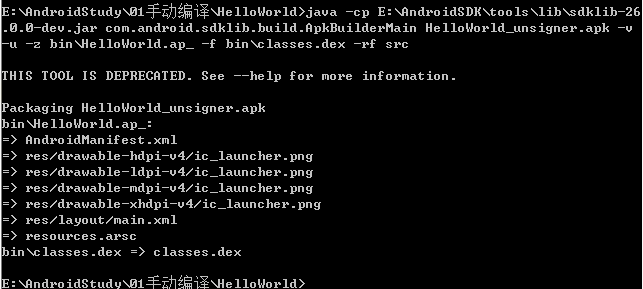

[toc]

# 1. 配置好环境变量
安装好java环境和androidsdk环境，并配置好如下环境变量。
```
$JAVA_HOME\bin;
$ANDROID_HOME\sdk\tools;
$ANDROID_HOME\platform-tools;
$ANDROID_HOME\build-tools\23.0.3;
```


# 2. 创建一个Android项目

1. 使用以下命令创建一个Android项目:

    `android.bat create project -n HelloWorld -t 17 -p E:\AndroidStudy\01手动编译\HelloWorld -k com.test.HelloWorld -a HelloWorld`

* 参数的意义，可以使用android.bat -help查看对应的帮助文档，android.bat在`\sdk\tools`目录中。
```
-n  项目的名称
-t  项目针对的android平台
-p  项目保存的路径
-k  项目的包名
-a  指定的Activity名称
```


命令自动创建了如下文件


# 3.使用aapt编译资源生成R.java

1. 在刚才生成的项目中新建一个文件夹gen,使用下列命令生成R.java。

    `aapt package -f -m -J gen -S res -I E:\AndroidSDK\platforms\android-19\android.jar -M  AndroidManifest.xml`
* 命令参数的意义
```
-f 如果编译出来的文件已经存在，强制覆盖。
-m 使生成的包的目录放在-J参数指定的目录。
-J 指定生成的R.java的输出目录
-S res文件夹路径
-A assert文件夹的路径
-M AndroidManifest.xml的路径
-I 某个版本平台的android.jar的路径
-F 具体指定apk文件的输出
```


此时可以发现在gen目录中生成了`\com\test\HelloWorld\R.java`文件，其中记录着资源ID。


# 4.使用javac编译java源码生成.class文件

1. 使用javac命令编译.java文件：

    `javac -source 1.6 -target 1.6 -d bin src\com\test\helloworld\*.java gen\com\test\helloworld\*.java -bootclasspath E:\AndroidSDK\platforms\android-19\android.jar`
* 命令参数的意义
```
-source 1.6：指定源码编译版本
-target 1.6：指定目标运行版本
-bootclasspath：表示编译需要用到的系统库 
-d：表示编译之后的class文件存放的目录
```
**关于这个地方指定的版本最好是使用1.6,如果使用默认的版本后面使用dx工具生成dex可能会出现各种问题.**


此时可以发现`\bin\com\test\HelloWorld`目录下已经生成了一堆*.class文件。

# 5.使用dx命令生成.dex文件

1. 使用dx命令生成.dex文件

    `dx --dex --output= bin\classes.dex bin`


此时可以发现bin目录中已经生成了`classes.dex`文件，如果这里出现错误，很有可能就是上面编译java是没有指定版本，导致编译的版本过高。


# 6.使用aapt命令生成资源包文件

1. 使用aapt命令生成资源包（包括res、assets、androidmanifest.xml等）
    
    `aapt package -f -m -J gen -S res -I E:\AndroidSDK\platforms\android-19\android.jar -M  AndroidManifest.xml -F bin\HelloWorld.ap_`


此时可以发现bin目录中已经生成了`HelloWorld.ap_`文件。

# 7.生成未签名的apk
1. 使用`sdklib.jar`命令生成未签名的apk包：

    `java -cp E:\AndroidSDK\tools\lib\sdklib-26.0.0-dev.jar com.android.sdklib.build.ApkBuilderMain HelloWorld_unsigner.apk -v -u -z bin\HelloWorld.ap_ -f bin\classes.dex -rf src`


# 8.利用JAVASDK提供的keytools工具生成证书文件
1. 使用KeyTool命令生成证书：
    
    `keytool -genkey -alias HelloWorld.keystore -keyalg RSA -validity 1000 -keystore HelloWorld.keystore -dname "CN=w,OU=w,O=localhost,L=w,ST=w,C=CN" -keypass 123456 -storepass 123456`    


# 9.通过jarsigner命令用证书文件对未签名的APK文件进行签名
1. 使用jarsigner命令签名：

    `jarsigner -verbose -keystore HelloWorld.keystore -signedjar HelloWorld_signer.apk HelloWorld_unsigner.apk HelloWorld.keystore`


# 10.安装，启动
* 使用adb命令安装apk：
    
    `adb install HelloWorld_signer.apk`


# 11. 补充签名验证机制：
将APK重命名为zip文件，然后可以看到有个META-INF的文件夹，里面有三个文件，分别名为MANIFEST.MF、CERT.SF和CERT.RSA，这些就是使用signapk.jar生成的签名文件。

## 1、 MANIFEST.MF文件：
程序遍历update.apk包中的所有文件(entry)，对非文件夹非签名文件的文件，逐个生成SHA1的数字签名信息，再用Base64进行编码。具体代码见这个方法：
```
    private static Manifest addDigestsToManifest(JarFile jar)
```
关键代码是：
```
    for (JarEntry entry: byName.values()) {
         String name = entry.getName();
         if (!entry.isDirectory() && !name.equals(JarFile.MANIFEST_NAME) &&
             !name.equals(CERT_SF_NAME) && !name.equals(CERT_RSA_NAME) &&
             (stripPattern == null ||!stripPattern.matcher(name).matches())){
             InputStream data = jar.getInputStream(entry);
             while ((num = data.read(buffer)) > 0) {
             md.update(buffer, 0, num);
           }
           Attributes attr = null;
           if (input != null) attr = input.getAttributes(name);
           attr = attr != null ? new Attributes(attr) : new Attributes();
           attr.putValue("SHA1-Digest", base64.encode(md.digest()));
           output.getEntries().put(name, attr);
        }
    }
```
之后将生成的签名写入MANIFEST.MF文件。关键代码如下：
```
    Manifest manifest = addDigestsToManifest(inputJar);
    je = new JarEntry(JarFile.MANIFEST_NAME);
    je.setTime(timestamp);
    outputJar.putNextEntry(je);
    manifest.write(outputJar);
```
## 2、 生成CERT.SF文件：
对前一步生成的Manifest，使用SHA1-RSA算法，用私钥进行签名。关键代码如下：
```
    Signature signature = Signature.getInstance("SHA1withRSA");
    signature.initSign(privateKey);
    je = new JarEntry(CERT_SF_NAME);
    je.setTime(timestamp);
    outputJar.putNextEntry(je);
    writeSignatureFile(manifest,
    new SignatureOutputStream(outputJar, signature));
```
## 3、 生成CERT.RSA文件：
生成MANIFEST.MF没有使用密钥信息，生成CERT.SF文件使用了私钥文件。那么我们可以很容易猜测到，CERT.RSA文件的生成肯定和公钥相关。 CERT.RSA文件中保存了公钥、所采用的加密算法等信息。核心代码如下：
```
    je = new JarEntry(CERT_RSA_NAME);
    je.setTime(timestamp);
    outputJar.putNextEntry(je);
    writeSignatureBlock(signature, publicKey, outputJar);
```
在程序中获取APK的签名时，通过signature方法进行获取，如下：
```
    packageInfo = manager.getPackageInfo(pkgname,PackageManager.GET_SIGNATURES);
    signatures = packageInfo.signatures;
    for (Signature signature : signatures) {
        builder.append(signature.toCharsString());
    }
    signature = builder.toString();
```
所以一般的程序就是在代码中通过判断signature的值，来判断APK是否被重新打包过。

**参考连接:**

[apk打包之用纯命令行打包apk（android4.4亲测可用)](http://blog.csdn.net/killer1989/article/details/46927995)

[命令行开发、编译、打包Android应用程序](http://www.cnblogs.com/wujd/archive/2012/01/10/wujiandong-android-1.html)
        


