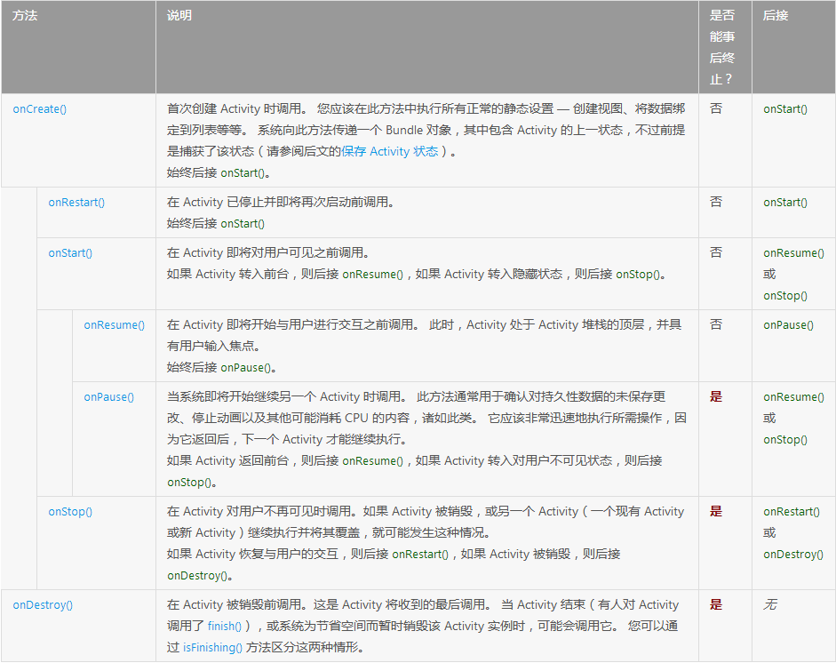

[toc]

# 1. 如何查看Android API
1. 离线或被墙的情况下直接去android-sdk-windows\docs目录下查看，一般使用火狐浏览器脱机模式就可以，速度也比较快。
* Reference选项显示的是API的使用。
* API guides选项API的使用向导，有比较详细的例子，一般遇到新的API不会使用时可以在这里查看。

2. 如果没有被墙，则可以直接去官方网站查看。
 
# 2. Android项目的目录结构
1. eclipse Android项目文件目录结构
```
src： 项目源文件;
R.java: 项目中所有资源文件的资源ID;
Android.jar: Android的jar包，导入此包方可使用Android的API;
libs: 导入第三方jar包;
assets: 存放音频，视频资源;
bin: 存放编译打包后的文件;
res: 存放资源文件，存放在此文件下的资源文件都会生成资源ID;
drawbale: 存放图片资源
layout: 存放布局文件，通过资源ID指定给Activity,界面就会显示出该布局文件定义的布局
menu: 定义菜单的样式
```

# 3. AndroidManifest.xml文件详解
AndroidManifest.xml是每个android程序中必须的文件。它位于application的根目录，描述了package中的全局数据，包括了package中暴露的组件(activities, services, 等等)，它们各自的实现类，各种能被处理的数据和启动位置。

1. manifest

    根节点，描述了package中所有的内容。在它之下能放置：
2. uses-permission

    请求你的package正常运作所需赋予的安全许可。见SecurityModel来获得许可的更多的信息。一个manifest能包含零个或更多此元素。
3. permission

    声明了安全许可来限制哪些程序能你package中的组件和功能。见SecurityModel来获得许可的更多的信息。一个manifest能包含零个或更多此元素。
4. instrumentation

    声明了用来测试此package或其他package指令组件的代码。见Instrumentation来获得许可的更多的信息。一个manifest能包含零个或更多此元素。
5. application

    包含package中application级别组件声明的根节点。此元素也可包含application中全局和默认的属性，如标签，icon，主题，必要的权限，等等。一个manifest能包含零个或一个此元素(不允许多余一个)。在它之下能放置零个或更多下列组件声明：
6. activity

    Activity是用来与用户交互的主要工具。当用户打开一个应用程序的初始页面时一个activity,大部分被使用到的其他页面也由不同的activity所实现并声明在另外的activity标记中。 注意：每一个activity必须要一个< activity>标记对应，无论它给外部使用或是只用于自己的package中。如果一个activity没有对应的标记，你将不能运行它。 另外，为了支持运行时迟查找你的activity,你能包含一个或多个< intent-filter>元素来描述你activity所支持的操作：
7. intent-filter

    声明了指定的一组组件支持的Intent值，从而形成了IntentFilter。除了能在此元素下指定不同类型的值，属性也能放在这里来描述一个操作所需的唯一的标签，icon和其它信息。
8. action

    组件支持的Intentaction。
9. category

    组件支持的IntentCategory.
10. type

    组件支持的Intentdata MIME type.
11. schema

    组件支持的Intentdata URI scheme.
12. authority

    组件支持的Intentdata URI authority.
13. path

    组件支持的Intentdata URI path.
14. receiver

    IntentReceiver能使得application获得数据的改变或者发生的操作，即使它当前不在运行。利用activity标记，你能选择地包含一个或多个receiver所支持的< intent-filter>元素;
15. service

    Service是能在后台运行任意时间的组件。利用activity标记，你能选择地包含一个或多个receiver所支持的< intent-filter>元素;
16. provider

    ContentProvider是用来管理持久化数据并发布给其他应用程序使用的组件。


> 在已生成的apk文件中AndroidManifest.xml文件实际上是.Axml文件，将xml文件中的字符串转成了二进制的文件，以便减小体积并且加快访问速度。


# 4. Activty组件
Activity 是一个应用组件，用户可与其提供的屏幕进行交互，以执行拨打电话、拍摄照片、发送电子邮件或查看地图等操作。 每个 Activity 都会获得一个用于绘制其用户界面的窗口。窗口通常会充满屏幕，但也可小于屏幕并浮动在其他窗口之上。每个用户界面都有一个Activity构成，一个个应用通常由多个彼此松散联系的 Activity 组成。
## 1. Activity 生命周期
```
启动应用程序的过程：Create --> Start --> Resume
当进入后台时：pause --> stop
再次进入程序时: Restart --> Start --> Resume
退出时：pause --> stop -->Destory 
```
Activity 基本上以三种状态存在
* 继续 

    此 Activity 位于屏幕前台并具有用户焦点。（有时也将此状态称作“运行中”。）
* 暂停

    另一个 Activity 位于屏幕前台并具有用户焦点，但此 Activity 仍可见。也就是说，另一个 Activity 显示在此 Activity 上方，并且该 Activity 部分透明或未覆盖整个屏幕。 暂停的 Activity 处于完全活动状态（Activity 对象保留在内存中，它保留了所有状态和成员信息，并与窗口管理器保持连接），但在内存极度不足的情况下，可能会被系统终止。
* 停止

    该 Activity 被另一个 Activity 完全遮盖（该 Activity 目前位于“后台”）。 已停止的 Activity 同样仍处于活动状态（Activity 对象保留在内存中，它保留了所有状态和成员信息，但未与窗口管理器连接）。 不过，它对用户不再可见，在他处需要内存时可能会被系统终止。

## 2. Activity 在状态转变期间可能经过的路径


## 3. Activity 生命周期回调方法汇总表。

**注：根据表中的定义属于技术上无法“终止”的 Activity 仍可能被系统终止 — 但这种情况只有在无任何其他资源的极端情况下才会发生**

## 4. Activity状态保存
    * 在两种情况下，Activity 重获用户焦点时可保持状态完好：系统在销毁 Activity 后重建 Activity，Activity 必须恢复之前保存的状态；系统停止 Activity 后继续执行 Activity，并且 Activity 状态保持完好。


## 5. Activity保存的是一个栈结构
    * 下图显示任务中的每个新 Activity 如何向返回栈添加项目。 用户按“返回”按钮时，当前 Activity 随即被销毁，而前一个 Activity 恢复执行。


## 备注
* 由于appt的功能比较强大，可以研究一下它的源码，将会对apk的格式有一个清楚的认识。
* super表示基类
* java中的每一个对象都类似于C++中的对象指针，只有这样才能实现多态，只是被隐藏了。
* 在java中对象只能使用new产生，并且不用释放，因为java自带垃圾回收机制，系统会自动回收空间，也可以使用代码通知垃圾回收，将对象赋值为nll,获取重新new一个对象。
* APK的启动过程
1. 查找并分析AndroidManifest.xml文件 
2. 创建并启动Activity
3. 分析布局文件activity_main.xml
4. 分析资源文件，根据ID获取资源
5. 显示到屏幕


