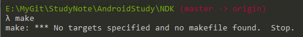
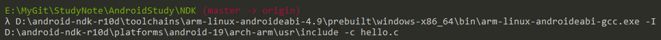
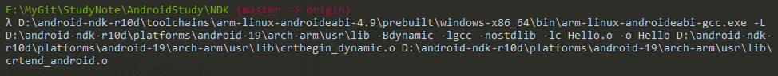

[toc]

##一、NDK环境配置
### 1.NDK目录结构

| 目录名        | 描述                                                                         |
|------------|----------------------------------------------------------------------------|
| build      | 存放和编译相关的脚本文件,最外面的ndk-build就是调用该目录下的makefile文件,其中makefile文件都存放在build/core目录 |
| docs       | 帮助文档                                                                       |
| platforms  | 存放不同android版本,不同平台架构的头文件和库文件                                               |
| prebuilt   | 存放和编译相关工具比如make.exe                                                        |
| samples    | ndk代码例子,用根目录下的ndk-build即可编译                                                |
| source     | 源码目录,有一些头文件和库文件,比如gnu-libstdc,stlport                                      |
| test       | 一些测试样例,有很多例子可以从里面学习                                                        |
| toolchains | 不同平台的编译器链接器目录以及一些和编译连接相关的工具,gcc,ld等工具都在这个目录                                |

### 2.添加环境变量
* 新建环境变量

    	ANDROID_NDK = D:\android-ndk-r10d

* 在Path环境变量中添加

    	%Android_NDK%   NDK根目录
    	%Android_NDK%\prebuilt\windows-x86_64\bin; make.exe目录

* 测试环境变量

    

    以上则表示环境变量成功。

### 3.编译

```
D:\android-ndk-r10d\toolchains\arm-linux-androideabi-4.9\prebuilt\windows-x86_64\bin\arm-linux-androideabi-gcc.exe -ID:\android-ndk-r10d\platforms\android-19\arch-arm\usr\include -c hello.c
```


### 4.链接
```
D:\android-ndk-r10d\toolchains\arm-linux-androideabi-4.9\prebuilt\windows-x86_64\bin\arm-linux-androideabi-gcc.exe -LD:\android-ndk-r10d\platforms\android-19\arch-arm\usr\lib -Bdynamic -lgcc -nostdlib -lc Hello.o -o Hello D:\android-ndk-r10d\platforms\android-19\arch-arm\usr\lib\crtbegin_dynamic.o D:\android-ndk-r10d\platforms\android-19\arch-arm\usr\lib\crtend_android.o
```


### 5.运行
```
adb push hello /data/local/tmp/     将文件拷到/data/local/tmp目录
adb shell chmod 777 /data/local/tmp/hello   修改文件属性
adb shell /data/local/tmp/hello     //运行程序
```

makefile
```
#文件名称
MODALE_NAME=hello

#ndk根目录
NDK_ROOT=D:/android-ndk-r10d

#编译器根目录
TOOLCHAINS_ROOT=$(NDK_ROOT)/toolchains/arm-linux-androideabi-4.9/prebuilt/windows-x86_64

#编译器目录
TOOLCHAINS_PREFIX=$(TOOLCHAINS_ROOT)/bin/arm-linux-androideabi

#头文件搜索路径
TOOLCHAINS_INCLUDE=$(TOOLCHAINS_ROOT)/lib/gcc/arm-linux-androideabi/4.9/include-fixed

#SDK根目录
PLATFROM_ROOT=$(NDK_ROOT)/platforms/android-19/arch-arm

#sdk头文件搜索路径
PLATFROM_INCLUDE=$(PLATFROM_ROOT)/usr/include

#sdk库文件搜索路径
PLATFROM_LIB=$(PLATFROM_ROOT)/usr/lib


#删除
RM=del

#编译选项
FLAGS=-I$(TOOLCHAINS_INCLUDE) \
      -I$(PLATFROM_INCLUDE)   \
      -L$(PLATFROM_LIB) \
      -nostdlib \
      -lgcc \
      -Bdynamic \
      -lc 

#所有obj文件
OBJS=$(MODALE_NAME).o \
     $(PLATFROM_LIB)/crtbegin_dynamic.o \
     $(PLATFROM_LIB)/crtend_android.o 


#编译器链接
all:
	$(TOOLCHAINS_PREFIX)-gcc.exe $(FLAGS) -c $(MODALE_NAME).c -o $(MODALE_NAME).o
	$(TOOLCHAINS_PREFIX)-gcc.exe $(FLAGS) $(OBJS) -o $(MODALE_NAME)
#删除所有.o文件
clean:
	$(RM) *.o
#安装程序到手机
install:
	adb push $(MODALE_NAME) /data/local/tmp
	adb shell chmod 755 /data/local/tmp/$(MODALE_NAME)
	adb shell /data/local/tmp/$(MODALE_NAME) 
#运行程序
run:
	adb shell /data/local/tmp/$(MODALE_NAME)  
```