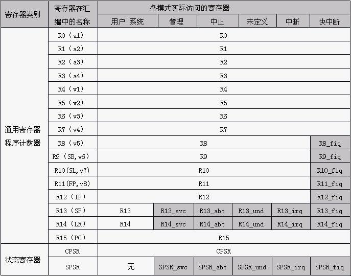
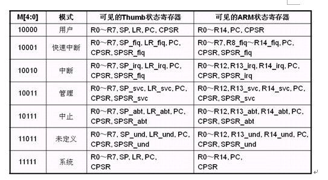

[TOC]

# 1. gnu as简介

GNU AS是GNU汇编器，主要用于把汇编代码转换成二进制代码，并存放到一个object文件中。GNU AS工具本身的使用方法比较简单，主要参考文档《Using as--the GNU Assembler》

## 1.1 本地程序的生成过程
预处理
`gcc –E hello.c  –o hello.i`
C到汇编
`gcc –S -mthumb  hello.i –o hello.s`
汇编到ARM
`gcc –c hello.s –o hello.o`
链接
`gcc hello.o –o hello`

## 1.2 ARM汇编程序结构

```asm
	.arch armv5te						@处理器架构
	.fpu softvfp						@协处理器
	.eabi_attribute 20, 1				@接口属性
	.eabi_attribute 21, 1
	.eabi_attribute 23, 3
	.eabi_attribute 24, 1
	.eabi_attribute 25, 1
	.eabi_attribute 26, 2
	.eabi_attribute 30, 6
	.eabi_attribute 34, 0
	.eabi_attribute 18, 4
	.file	"hello.c"					@源文件
	.section	.rodata					@声明只读数据段
	.align	2							@对其方式为2^2=4字节
.LC0:									@标号
	.ascii	"Hello World!\015\000"		@声明字符串
	.text								@声明代码段
	.align	2							@对其方式为2^2=4字节
	.global	main						@全局符号main
	.type	main, %function				@main的类型为函数
main:									@标号
	@ args = 0, pretend = 0, frame = 8
	@ frame_needed = 1, uses_anonymous_args = 0
	stmfd	sp!, {fp, lr}				@将fp, lr寄存器值压入堆栈
	add	fp, sp, #4						@初始化fp寄存器，用于访问局部变量
	sub	sp, sp, #8						@申请堆栈空间
	str	r0, [fp, #-8]					@保存第一个参数
	str	r1, [fp, #-12]					@保存第二个参数
	ldr	r3, .L3							@取标号.L3的内容，即Hello World!偏移
.LPIC0:
	add	r3, pc, r3						@计算Hello World!的内存地址
	mov	r0, r3							@设置参数1
	bl	puts(PLT)						@调用puts函数
	mov	r3, #0							@设置r3寄存器为0
	mov	r0, r3							@设置返回值
	sub	sp, fp, #4						@恢复sp的值
	@ sp needed							
	ldmfd	sp!, {fp, pc}				@恢复fp的值，并把lr的值给pc
.L4:
	.align	2							
.L3:
	.word	.LC0-(.LPIC0+8)				@保存字符串相对add r3, pc, r3的偏移量
	.size	main, .-main				@main函数大小为当前代码行减轻去main的标号
	.ident	"GCC: (GNU) 4.9.x 20150123 (prerelease)"	@ 编译器标识
	.section	.note.GNU-stack,"",%progbits	@ 定义.note.GNU-stack段Gas，声明堆栈不可运行代码

```


## 1.3 段定义
ARM汇编采用.section定义段(节区),格式为：
 ` .section name [, "flags"[, @type[,flag_specific_arguments]]]`

* `name`:段的名称

- `flags`:段的属性(读写执行)
- `type`:段的类型(`progbits`包含数据`note `包含数据非程序本身使用)
-  `flag_specific_arguments`: 指定平台的相关参数

`.section .rodata`  声明只读数据段
`.text`   声明代码段
`.section	.note.GNU-stack,"",%progbits ` 声明堆栈不可运行代码
详细信息查看gas在线手册: http://sourceware.org/binutils/docs/as/index.html

## 1.4 汇编器指令 (伪指令)

程序中所有以`.`开头的指令都是汇编器指令，汇编器指令与汇编器相关的，它们不属于`ARM`指令集。`Gas`汇编器支持的汇编器指令比较多，在`gas`在线文档的第7章`Assembler Directives`中列出来额上有的汇编器指令
```
.file：指定了源文件名。实例hello.s是从hello.c编译得来的，手写汇编代码时可以忽略它。
.align：指定代码对齐方式，后面跟的数值为2的次数方。如“.align 4”表示2^4=16字节对齐。
.ascii：声明字符串。
.global：声明全局符号。全局符号是指在本程序外可以访问的符号。
.type：指定符号的类型。“.type main, %function”表示main符号为函数。
.word：用来存放地址值。“.word .LC0-(.LPIC0+8)”存放的是一个与地址无关的偏移量。
.size：设置指定符号的大小。“.size main, .-main”中的点“.”表示当前地址，减去main符号的地址即为整个main函数的大小。
.ident：编译器标识，无实际用途，生成可执行程序后它的值被放置到“.comment”段中。
``` 

### 1.4.1 函数与参数传递
ARM 汇编中声明函数的方法：

```
  	.global 函数名
  	.type  函数名,%funtion
 函数名:
   		函数体
```

例子: 加法函数

```asm
  	.global MyAdd
  	.type MyAdd,%funtion
 MyAdd:
	Add r0,r0,r1   	@两参数相加
	Mov pc,lr     	@函数返回
```


## 1.5 ARM处理器工作状态

`ARM`处理器有两种工作状态:`ARM`状态和`Thumb`状态,处理器可以再两种状态随意切换。当处理器处于`ARM`状态时，处理器执行32位字对齐的指令，当处理器处于`Thumb`状态时，处理器执行16位对齐的指令。`Thumb`状态下的寄存器命名与`ARM`状态有部分的差异，差异如下：
`Thumb`状态下的`R0~R7`与`ARM`状态下`R0~R7`相同.
`Thumb`状态下的`CBSR`与`ARM`状态下`CBSR`相同.
`Thumb`状态下的`FP`对应于`ARM`状态下`R11`.
`Thumb`状态下的`IP`对应于`ARM`状态下`R12`.

## 1.6 ARM处理器工作模式

用户模式(User):ARM处理器正常的程序执行状态
快速中断模式(FIQ): 用于高速数据传输或通道处理
外部中断模式(IRQ):用于通用的中断处理
管理模式(Supervisor):操作系统使用的保护模式
数据访问终止模式(Abort):当数据或指令预取终止时进该模式,可用于虚拟存储及存储保护
系统模式(System):运行具有特权的操作系统任务
未定义指令中止模式(Undifined):当未定义的指令执行进入该模式,可用于支持硬件协处理器的软件仿真


# 2. ARM汇编基础

## 2.1 ARM和x86比较

- 精简指令集

> 对于每一个复杂的操作，与x86汇编相比具有更多的指令。

- 固定的指令长度

> x86有可变长度的指令， ARM将指令长度固定为32位

- 内存对齐

> ARM/RISC要求内存对齐; 对齐内存需要进行填充。

- 条件执行

> 每条指令的前四位包含一个条件码

## 2.2 .ARM寄存器

> 在ARM处理器内部共有37个用户可访问的寄存器
> 31个通用的32位寄存器
> 6个状态寄存器



- `R0~R7`、`R15`、`CPSR`寄存器组在任何模式下都是公用的，可以访问的；
- `R8~R12`寄存器组在快中断模式下(FIQ)对应一套私有寄存器组`R8_Fiq~R12_fiq`, 在其他模式下公用另一套寄存器组；
- `R13、R14`寄存器在用户和系统模式下公用一套，其他模式下都是具有两个私有寄存器`R13`和`R14`。这就使得这些模式中的每一种模式都具有各自的堆栈寄存器指针`R13`和链接寄存器`R14`,分别用于堆栈处理和异常退出；
- `SRSR`寄存器可用于保存`CRSR`的值，在用户和系统模式下不能访问，在其他模式下都有私有的`SPSR`寄存器；

### 一般通用寄存器 R0～R12

- 寄存器`R0～R12`为保存数据或地址值的一般通用寄存器。其中寄存器`R0～R7`为未分组的寄存器，`R8～R12`为分组寄存器;
- 未分组的寄存器意味着对于任何处理器模式，他们中的每一个都对应于相同的32位物理寄存器。他们是完全通用的寄存器;
- 分组寄存器意味着同一个寄存器名对应多个物理寄存器，具体所对应的物理寄存器取决于当前的处理器模式。参照表2-1，寄存器`R8～R12`有两个分组物理寄存器。一组用于除`FIQ`模式之外的所有寄存器模式（`R8～R12`），另一组用于`FIQ`模式（`R8_fiq～R12_fiq`）;
- 寄存器`R8～R12`在ARM体系结构中没有特定的用途。不过对于那些只使用`R8～R14`来说就足够处理的简单的中断，`FIQ`所单独使用的这些寄存器可实现快速的中断处理;

### 堆栈指针 R13

- 寄存器`R13`（也称为堆栈指针或SP）有6个分组的物理寄存器。一个用于用户和系统模式，其余5个分别用于5种异常模式
- 寄存器`R13`通常作为堆栈指针SP。在ARM指令集中，R13大都用在对各个模式下的堆栈操作。每个异常模式都具备私有的R13寄存器，它通常指向由异常模式所专用的堆栈。在入口处，通常将寄存器值保存到这个堆栈。在模式转换前将当前寄存器的值保存到堆栈中，然后从将要切换的模式堆栈中将这些值从堆栈重装到已切换的模式寄存器中，这种处理方法可确保异常发生时的程序状态不会被破坏

### 链接寄存器 R14

- 寄存器R14（也称为链接寄存器或LR）有6个分组的物理寄存器，一个用于用户和系统模式，其余5个分别用于5种异常模式，对应的私有寄存器有R14_svc，R14_irq，R14_fiq，R14_abt和R14_und。寄存器R14有三种用途：
  - 当发生异常时，它被设置为该异常返回地址；
  - 在执行分支和链接（BL）指令时，它用于保存子程序的返回地址
  - 而在其他时候，可以作为一个通用寄存器来对待

### 程序计数器 R15

- 寄存器R15（也称为程序计数器或PC）总是用于特殊用途，它总是指向下一条要读取指令的地址。你可以把R15当作通用寄存器使用，但使用时还有与指令有关的限制或特殊情况。如果R15使用的方式超过了这些限制，那么指令将是不可预测的
- 由于ARM7采用3级流水线结构，在ARM状态下，读取R15的值是当前执行指令地址 + 8。ARM指令以字为单位，读取R15结果的bit[1:0]总是为0b00
- 对R15进行写时，如果这条写指令没有超过对R15使用的限制，那么写入R15的正常结果值被当成一个指令地址，程序会从这个地址处继续执行（相当于执行无条件跳转指令）。因为ARM指令以字为边界，所以写入R15值的bit[1:0]通常为0b00

### CPSR和SPSR

- 所有模式共享一个程序状态寄存器CPSR。在异常模式中，程序状态保存寄存器SPSR可以被访问，每种异常具有自己私有的SPSR。在进入异常时，它保存CPSR的当前值；在异常退出时，可通过它(SPSR)恢复CPSR
  
- N:当该位为1时：表示负数。为0时：表示正数
- Z:当该位为1时：表示两数相等。为0时：表示两数不相等
- C:当该为1时：若为加法运算(含CMN)表示产生进位，否则C=0
- V:当该位为1时：使用加法/减法运算时，表示有符号溢出。；否则V=0
- I：当I位为1时，IRQ中断被禁止
- F：当F位为1时，FIQ中断被禁止
- T：当T位为1时，处理器处于Thumb状态下运行。当T位为0时，处理器处于ARM状态下运行
- **M4,M3,M2,M1和M0位都是模式位。这些位决定处理器的操作模式（不是所用模式位的组合都定义有有效的处理器模式，因此注意不要使用表中未列出的组合**
  


