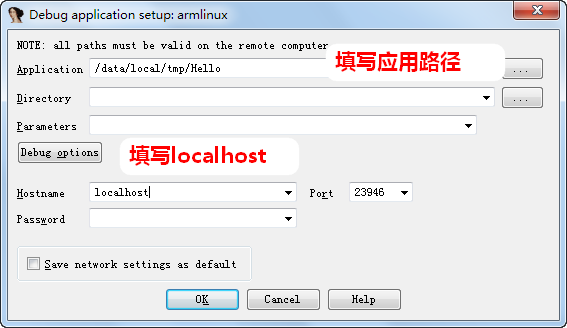
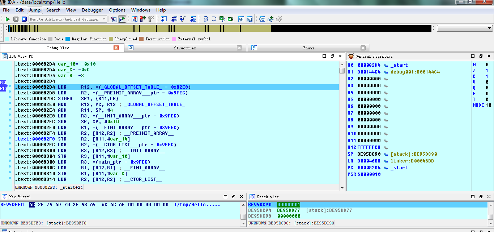

[toc]

<!-- TOC -->

- [1. 使用IDA调试ARM程序](#1-使用ida调试arm程序)
  - [1.1. 配置环境](#11-配置环境)
    - [1.1.1. 将 ida dbgsrv目录下的 android_server 拷贝到 android 手机的 /data/local/tmp 目录中，给予其执行权限。](#111-将-ida-dbgsrv目录下的-android_server-拷贝到-android-手机的-datalocaltmp-目录中给予其执行权限)
  - [1.2. 开始调试](#12-开始调试)
    - [1.2.1. 运行 android_server](#121-运行-android_server)
    - [1.2.2. 端口映射](#122-端口映射)
    - [1.2.3. 启动IDA打开 debugger->run->remote Armlinux/andoid debugger , 填写为localhost，端口为23946。](#123-启动ida打开-debugger-run-remote-armlinuxandoid-debugger--填写为localhost端口为23946)
    - [1.2.4. 开始调试](#124-开始调试)
- [2. 使用gdb调试ARM程序](#2-使用gdb调试arm程序)
  - [2.1. 准备工作](#21-准备工作)
    - [2.1.1. 把 android ndk prebuilt/android-arm/gdbserver 目录下的 gdbserver 拷贝到 Adnroid 设备上，给予其可执行权限，可以通过如下命令](#211-把-android-ndk-prebuiltandroid-armgdbserver-目录下的-gdbserver-拷贝到-adnroid-设备上给予其可执行权限可以通过如下命令)
  - [2.2. 开始调试](#22-开始调试)
    - [2.2.1. 使用 gdb 启动调试程序。](#221-使用-gdb-启动调试程序)
    - [2.2.2. 端口转发。](#222-端口转发)
    - [2.2.3. 运行 ANDROID_NDK/prebuilt/windows-x86_64/bin/gdb 。](#223-运行-android_ndkprebuiltwindows-x86_64bingdb-)
    - [2.2.4. 在 gdb 下设置你希望调试的 ARM 程序。](#224-在-gdb-下设置你希望调试的-arm-程序)
    - [2.2.5. 连接到设备的 gdbserver 。](#225-连接到设备的-gdbserver-)
    - [2.2.6. 开始调试。](#226-开始调试)

<!-- /TOC -->

# 1. 使用IDA调试ARM程序
## 1.1. 配置环境
### 1.1.1. 将 ida dbgsrv目录下的 android_server 拷贝到 android 手机的 /data/local/tmp 目录中，给予其执行权限。
```
λ adb push android_server /data/local/tmp
android_server: 1 file pushed. 3.3 MB/s (589588 bytes in 0.171s)

adb shell
root@1603_A02:/ # cd /data/local/tmp/
root@1603_A02:/data/local/tmp # chmod 777 android_server
```

## 1.2. 开始调试
### 1.2.1. 运行 android_server
```
root@1603_A02:/data/local/tmp # ./android_server
IDA Android 32-bit remote debug server(ST) v1.22. Hex-Rays (c) 2004-2017
Listening on 0.0.0.0:23946...
```

### 1.2.2. 端口映射
```
adb forward tcp:23946 tcp:23946
```

### 1.2.3. 启动IDA打开 debugger->run->remote Armlinux/andoid debugger , 填写为localhost，端口为23946。



### 1.2.4. 开始调试



# 2. 使用gdb调试ARM程序
## 2.1. 准备工作
### 2.1.1. 把 android ndk prebuilt/android-arm/gdbserver 目录下的 gdbserver 拷贝到 Adnroid 设备上，给予其可执行权限，可以通过如下命令
```
λ adb push gdbserver /data/local/tmp
gdbserver: 1 file pushed. 3.3 MB/s (596484 bytes in 0.170s)

λ adb shell
root@1603_A02:/ # cd data/local/tmp
root@1603_A02:/data/local/tmp # chmod 777 gdbserver
```

## 2.2. 开始调试
### 2.2.1. 使用 gdb 启动调试程序。
```
root@1603_A02:/data/local/tmp # ./gdbserver :7788 hello
Process hello created; pid = 8565
Listening on port 7788
```

### 2.2.2. 端口转发。
```
adb forward tcp:7788 tcp:7788
```

### 2.2.3. 运行 ANDROID_NDK/prebuilt/windows-x86_64/bin/gdb 。
```
λ gdb
GNU gdb (GDB) 7.11
Copyright (C) 2016 Free Software Foundation, Inc.
License GPLv3+: GNU GPL version 3 or later <http://gnu.org/licenses/gpl.html>
This is free software: you are free to change and redistribute it.
There is NO WARRANTY, to the extent permitted by law.  Type "show copying"
and "show warranty" for details.
This GDB was configured as "x86_64-w64-mingw32".
Type "show configuration" for configuration details.
For bug reporting instructions, please see:
<http://www.gnu.org/software/gdb/bugs/>.
Find the GDB manual and other documentation resources online at:
<http://www.gnu.org/software/gdb/documentation/>.
For help, type "help".
Type "apropos word" to search for commands related to "word".
(gdb)
```

### 2.2.4. 在 gdb 下设置你希望调试的 ARM 程序。
```
(gdb) file ./hello
warning: A handler for the OS ABI "Cygwin" is not built into this configuration
of GDB.  Attempting to continue with the default armv5te settings.

Reading symbols from ./hello...(no debugging symbols found)...done.
```

### 2.2.5. 连接到设备的 gdbserver 。
```
(gdb) target remote :7788
Remote debugging using :7788
Reading /system/bin/linker from remote target...
warning: File transfers from remote targets can be slow. Use "set sysroot" to access files locally instead.
Reading /system/bin/linker from remote target...
warning: A handler for the OS ABI "Cygwin" is not built into this configuration
of GDB.  Attempting to continue with the default arm settings.

Reading symbols from target:/system/bin/linker...(no debugging symbols found)...done.
0xf77cf664 in __dl__start () from target:/system/bin/linker
```

### 2.2.6. 开始调试。
直接运行
```
(gdb) c
Continuing.
Reading /system/lib/libdirect-coredump.so from remote target...
Reading /system/lib/libc.so from remote target...
Reading /system/lib/libcutils.so from remote target...
Reading /system/lib/libc++.so from remote target...
Reading /system/lib/libm.so from remote target...
Reading /system/lib/liblog.so from remote target...
Reading /system/lib/libnetd_client.so from remote target...
Reading /system/lib/libunwind.so from remote target...
Reading /system/lib/libaed.so from remote target...
Reading /system/lib/libselinux.so from remote target...
Reading /system/lib/libmrdump.so from remote target...
Reading /system/lib/libz.so from remote target...
Reading /system/lib/libstdc++.so from remote target...
Reading /system/lib/libpcre.so from remote target...
[Inferior 1 (process 8565) exited normally]
```