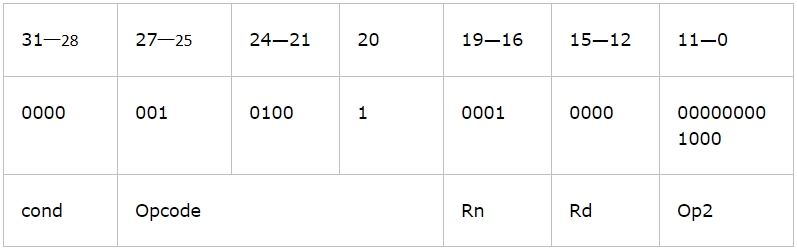
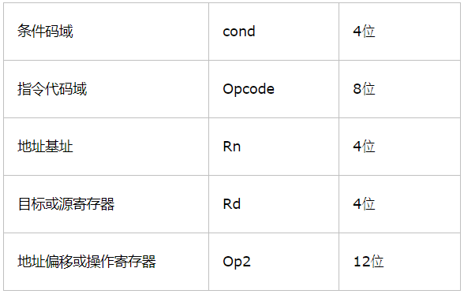
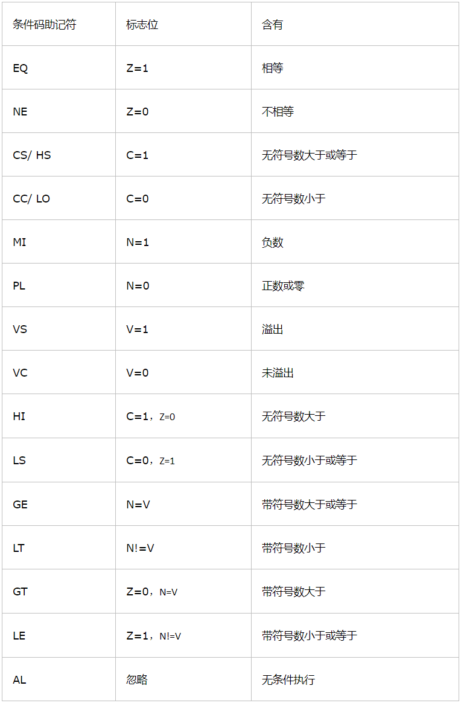
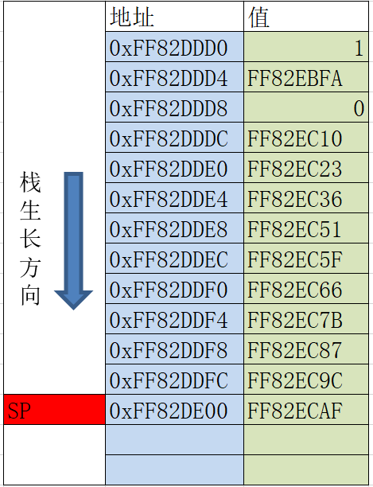
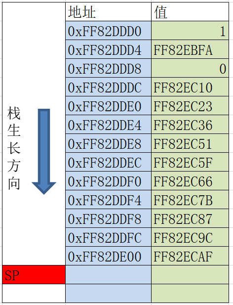
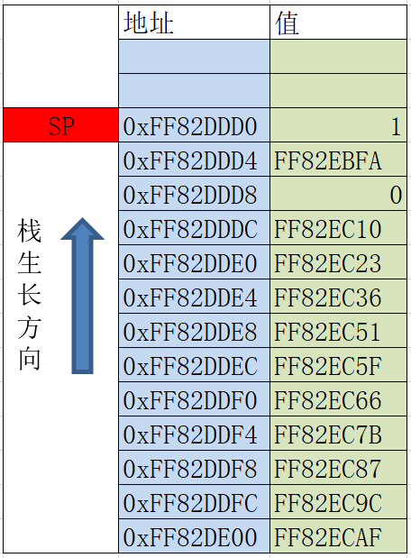
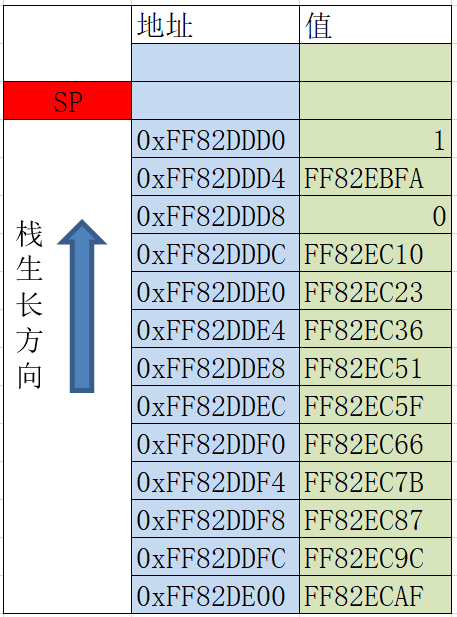
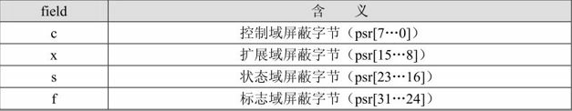

[toc]

# 1. ARM指令格式
## 1.1 二进制代码形
以`ADDEQS R0,R1,#8`为例，其二进制代码形式为：



从上面可知，ARM指令一般包括5个域：



## 1.2 汇编指令格式

```
<opcode>{<cond>}{S}{.W|.N}<Rd>,<Rn>{,<operand2>}

<>表示该内容必不可少，{}表示可省略。

<opcode>表示操作码，如ADD表示算术加法。

{<cond>}  表示指令执行的条件域，如EQ，NE等。缺省则表示默认条件（无条件执行）。

{S}      决定指令的执行结果是否影响CPSR的值，使用该后缀则指令执行的结果影响CPSR的值，否则不影响。

{.W|.N}　　

　　使用.W 宽度说明符。 即使 16 位编码可用，该指令宽度说明符也会强制汇编器生成 32 位编码。
无论代码将会被汇编为 ARM 代码还是 Thumb（ARMv6T2 或更高版本）代码，您都可在其中使用 .W 说明符。 
.W 说明符不会对代码的 ARM 编译产生任何影响。

　　如果要将指令汇编为 16 位编码，则您可使用 .N 宽度说明符。 
在这种情况下，如果指令无法编码为 16 位，或者要将代码汇编为 ARM 代码，则汇编器会生成错误。

　　使用指令宽度说明符时，必须将说明符紧随在指令助记符和条件代码（如果有）之后，例如：
    BCS.W   label   ; forces 32-bit instruction even for a short branch

    B.N     label   : faults if label out of range for 16-bit instruction


<Rd>      表示目的寄存器。

<Rn>      表示第一个操作数，为寄存器。

<Op2>      表示第二个操作数，可以使立即数，寄存器或寄存器偏移操作数。
```

上述指令`ADDEQS R0，R1，#8`；其中操作码为`ADD`，条件域为`EQ`，`S`表示该指令的执行影响`CPSR`寄存器的值，`R0`为目的寄存器，`R1`为第一个操作数寄存器，立即数`#8`为第二个操作数。

## 1.3 条件码助记符



# 2. ARM指令寻址方式

## 2.1 寄存器寻址
```
mov r0, r1
add r0, r1, r2
```

## 2.2 立即寻址
```
mov r1, #2
subs r0, r0, #0xff00
```

## 2.3 寄存器移位寻址(移位不占指令周期)
```
mov r0, r1, LSL #2      ;r1的值逻辑左移2位，结果放入r0,即r0=r1*4
add r0, r1, r2, LSL #3  ;r2的值逻辑左移3位，然后和r1相加，结果放入r0, 即r0=r1+r2*8
ands r0, r1, r2, LSL r3  ;r2的值逻辑左移r3位，然后和r1相与操作，结果放入r0
```

## 2.4 寄存器间接寻址
```
ldr r0, [sp]
str r1, [sp]
```

## 2.5 基址寻址
```
ldr r0, [sp, #0xC]
ldr r0, [sp, #-4]!
ldr r0, [sp], #4
```

## 2.6多寄存器寻址
```
stmfd sp!, {r0, r1, r2}    @从右向左入栈
mov r0, #123
ldmfd sp!, {r0, r1, r2}
```

## 2.7堆栈寻址

向高地址方向生长，称之为**递增堆栈**。
向低地址方向生长，称之为**递减堆栈**。
堆栈指针指向最后压入的堆栈的有效数据项，称为**满堆栈**。
堆栈指针指向下一个要放入的空位置，称为**空堆栈**。

**满递增**：堆栈通过增大存储器的地址向上增长，堆栈指针指向内含有效数据项的最高地址。


**空递增**：堆栈通过增大存储器的地址向上增长，堆栈指针指向堆栈上的第一个空位置。


**满递减(常用)**：堆栈通过减小存储器的地址向下增长，堆栈指针指向含有效数据项的最低地址。

```
stmfd sp!, {r1-r7, lr}      ;将r1-r7, lr 从右向左依次入栈，满递减堆栈。
ldmfd sp!, {r1-r7, lr}      ;数据出栈，放入r1-r7, lr 寄存器，满递减堆栈。
```


**空递减**：堆栈通过减小存储器的地址向下增长，堆栈指针指向堆栈下一个空位置。


## 2.8 拷贝块寻址
多寄存器传送指令用于一块数据从存储器的某一位置拷贝到另一位置。
```
stmia r0!, {r1-r7}  ;将r1-r7的数据保存到r0指向的地址之后，增长方向为递增。
stmib r0!, {r1-r7}  ;将r1-r7的数据保存到r0指向的地址之前，增长方向为递增。
stmda r0!, {r1-r7}  ;将r1-r7的数据保存到r0指向的地址之后，增长方向为递减。
stmdb r0!, {r1-r7}  ;将r1-r7的数据保存到r0指向的地址之前，增长方向为递减。
```

## 2.9 相对寻址
相对寻址是基址寻址的一种变通，由程序计数器PC提供基准基地址，指令中的地址码字段作为偏移量，两者相加后得到的地址即为有效地址。
```
BL  ROUTE1     ;调用ROUTE1子程序
BEQ LOOP       ;条件跳转到LOOP标号处
...
LOOP MOV R2, #2
...
ROUTE1
...
```

# 3. ARM指令集
## 3.1 ARM存储器访问指令

### LDR和STR 
加载/存储字和无符号字节指令，LDR指令用于从内存中读取数据；STR指令用于将寄存器中的数据保存到内存。指令格式如下：
```
LDR{cond}{T} Rd, <地址>		;加载指定地址上的数据(4字节)，放入Rd中
STR{cond}{T} Rd, <地址>		;存储Rd中的数据到指定的的存储单元(4字节)
LDR{cond}B{T} Rd, <地址>	;加载指定地址上的字节数据，放入Rd中，高24位清零
STR{cond}B{T} Rd, <地址>	;存储Rd中的字节数据到指定的的存储单元，最低位字节有效
LDR{cond}SB Rd, <地址>		;加载指定地址上的数据(带符号字节)，放入Rd中
LDR{cond}SH Rd, <地址>		;加载指定地址上的数据(带符号半字)，放入Rd中
LDR{cond}H Rd, <地址>		;加载指定地址上的数据(半字)，放入Rd中
STR{cond}H Rd, <地址>		;储Rd中的半字数据到指定的的存储单元
其中T为可选后缀，若指令有T，那么即使处理器是在特权模式下，存储系统也将访问看成是处理器在用户模式下。

例子：
	ldr r4, [sp, #0x12]         ;r4 = [sp + 0x12]
	str r4, [sp]                ;[sp] = r4
	mov r5, #2              
	ldr r4, [sp, r5, lsl #2]    ;r4 = [sp+r5*4]
	mov r5, sp 
	ldr r4, [r5, #4]!           ;r5 = r5+4, r4 = [r5]
	ldr r4, [r5], #4            ;r4 = [r5], r5 = r5+4
	ldrb r4, [r5], #4           ;r4 = byte ptr[r5], r5 = r5 + 4
	strb r4, [sp, #-4]          ;byte ptr[sp-4] = r4 & 0x00000001
	mov r5, sp 
	ldrsb r4, [r5]				;r4 = byte ptr[r5] 高位补符号位
	ldrsh  r4, [r5, #4]			;r4 = word ptr[r5] 高位补符号位
	ldrh r4, [r5]				;r4 = word ptr[r5] 高位0
	strh r4, [r5, #-4]			;word ptr[r5+4] = r4
```

### LDM和STM
批量加载/存储指令可以现实在一组寄存器和一块连续的内存单元之间传输数据。
```
LDM{cond}<模式> Rn{!}, reglist{^}
STM{cond}<模式> Rn{!}, reglist{^}
8种模式：
1. IA: 每次传送后地址加4
2. IB: 每次传送前地址加4
3. DA: 每次传送后地址减4
4. DB: 每次传送前地址减4
5. FD: 满递减堆栈
6. ED: 空递减堆栈
7. FA: 满递增堆栈
8. EA: 空递增堆栈

其中Rn不允许位R15，后缀!表示最后的地址回写到Rn中。

例子：
STMIA sp,{r1-r7}
LDMIA sp,{r1-r7}

```

### swp
寄存器和存储器交换指令。
```
swp{cond}{B} Rd, Rm, [Rn]
B是可选的字节，若有B，则交换字节，否则交换32位的字。
Rd为要从存储器中加载数据的寄存器。
Rm为写入数据到存储器的寄存器。
Rn为需要进行数据交换的存储器地址。Rn不能与Rd和Rm相同。
如果Rd与Rm相同，可实现单个寄存器与存储器的数据交换。

例子：
swp R1, R1, [R0]		;将R1与R0指向的存储单元内容进行交换
swpb R1, R2, [R0]		;从R0指向的存储单元读取一个字节存入R1(高24位清0)，然后将R2寄存器的字节内容存储到该存储单元。
```

## 3.2 跳转指令
### B 跳转指令
B{cond} label

B指令属于ARM指令集，是最简单的分支指令。当执行B指令时，如果条件cond满足，ARM处理器将立即跳转到label指定的地址处继续执行。例如：“BNE LABEL”表示条件码Z=0时跳转到LABEL处执行。

### BL 带链接的跳转指令
BL{cond} label

当执行BL指令时，如果条件cond满足，会首先将当前指令的下一条指令的地址拷贝到R14（即LR）寄存器中，然后跳转到lable指定的地址处继续执行。这条指令通常用于调用子程序，在子程序的尾部，可以通过“MOV PC, LR”返回到主程序中。

### BX带状态切换的跳转指令
BX{cond} Rm
当执行BX指令时，如果条件cond满足，则处理器会判断Rm的位[0]是否为1，如果为1则跳转时自动将CPSR寄存器的标志T置位，并将目标地址处的代码解释为Thumb代码来执行，即处理器会切换至Thumb状态；反之，若Rm的位[0]为0，则跳转时自动将CPSR寄存器的标志T复位，并将目标地址处的代码解释为ARM代码来执行，即处理器会切换到ARM状态。

### BLX带链接和状态切换的跳转指令
BLX{cond} Rm
BLX指令集合了BL与BX的功能，当条件满足时，除了设置链接寄存器，还根据Rm位[0]的值来切换处理器状态。


## 3.3 数据处理指令
### MOV
MOV为ARM指令集中使用最频繁的指令，它的功能是将8位的立即数或寄存器的内容传送到目标寄存器中。指令格式如下：
```
MOV{cond}{S} Rd, operand2

例子：
mov R0, #8 				;R0 = 8
mov R1, R0				;R1 = R0
movs R2, R1, LSL #2 	;R2 = R1*4, 影响符号位
```

### MVN
MVN为数据非传送指令。它的功能是将8位的立即数或寄存器按位取反后传送到目标寄存器中。
```
MVN{cond}{S} Rd, operand2
例子：
MVN R0, #0xff 	;R0 = 0xFFFFFF00
MVN R1, R2		;将R2的值按位取反后存入R1寄存器
```

### ADD
ADD为加法指令。它的功能是将Rn寄存器与operand2的值相加，结果保存到Rd寄存器。
```
ADD{cond}{S} Rd, Rn, operand2
例子：
ADD R0, R1, #2		;R0=R1+2
ADDS R0, R1, R2		;R0=R1+R2, 影响标志位
ADD R0, R1, LSL #3 	;R0=R1*8
``` 

### ADC 
ADC为带进位加法指令。它的功能是将Rn寄存器与operand2的值相加，再加上CPSR寄存器的C条件标志位的值，最后将结果保存到Rd寄存器。
```
ADC{cond}{S} Rd, Rn, operand2
例子：
ADD R0, R0, R2
ADC R1, R1, R3		;两条指令完成64位加法， (R1, R0) = (R1, R0) + (R3, R2)
```

### SUB 
SUB为减法指令。它的功能是用Rn寄存器减去operand2的值，结果保存到Rd寄存器中。
```
SUB{cond}{S} Rd, Rn, operand2

例子 ：
SUB R0, R1, #4 		;R0 = R1 - 4 
SUBS R0, R1, R2 	;R0 = R1 - R2, 影响标志位
``` 

### RSB
RSB为逆向减法指令。它的功能是用operand2减去Rn寄存器，结果保存到Rd寄存器中。
```
RSB{cond}{S} Rd, Rn, operand2

例子：
RSB R0, R1, #0x1234 ;R0 = 0x1234 - R1 
RSB R0, R1 			;R0 = -R1
```

### SBC 
SBC为带进位减法指令。它的功能是用Rn寄存器减去operand2的值，再减去CPSR寄存器的C条件标志位的值，最后将结果保存到Rd寄存器。
```
SBC{cond}{S} Rd, Rn, operand2

例子：
SUBS R0, R0, R2
SBC R1, R1, R3 		;两条指令完成64位减法，(R1, R0) = (R1, R0) - (R2, R3)
```

### RSC 
RSC为带进位逆向减法指令。它的功能是用operand2减去Rn寄存器，再减去CPSR寄存器的C条件标志位的值，最后将结果保存到Rd寄存器。
```
RSC{cond}{S} Rd, Rn, operand2

例子：
RSBS R2, R0, #0 
RSC R3, R1, #0 		;两条指令完成64位数取反，(R3, R2) = -(R1, R0)
``` 

### MUL 
MUL为32位乘法指令。它的功能是将Rm寄存器与Rn寄存器的值相乘，结果的低32位保存到Rd寄存器中。
```
MUL{cond}{S} Rd, Rm, Rn

例子：
MUL R0, R1, R2		;R0 = R1*R2
MULS R0, R2, R3 	;R0 = R2*R3, 影响CPSR的N位和Z位
``` 

### MLS 
MLS指令将Rm寄存器和Rn寄存器中的值相乘，然后再从Ra寄存器的值中减去乘积，最后将所得结果的低32位存入Rd寄存器中。
```
MLS{cond}{S} Rd, Rm, Rn, Ra

例子：
MLS R0, R1, R2, R3		;R0的值为R3 - R1*R2结果的低32位。
``` 

### MLA 
MLA指令将Rm寄存器和Rn寄存器中的值相乘，然后再将乘积与Ra寄存器中的值相加，最后将结果的低32位存入Rd寄存器中。
```
MLA{cond}{S} Rd, Rm, Rn, Ra

例子：
MLA R0, R1, R2, R3		;R0的值为R3 + R1*R2结果的低32位。
``` 

### UMULL 
UMULL指令将Rm寄存器和Rn寄存器的值作为无符号数相乘，然后将结果的低32位存入RdLo寄存器，高32位存入RdHi寄存器。
```
UMULL{cond}{S} RdLo, RdHi, Rm, Rn

例子：
UMULL R0, R1, R2, R3	;(R1,r0) = R2 * R3

``` 

### UMLAL
UMLAL指令将Rm寄存器和Rn寄存器的值作为无符号数相乘，然后将64位的结果与RdHi、RdLo组成的64位数相加，结果的低32位存入RdLo寄存器，高32位存入RdHi寄存器。
```
UMLAL{cond}{S} RdLo, RdHi, Rm, Rn

例子：
UMLAL R0, R1, R2, R3	;(R1, R0) = R2 * R3 + (R1, R0)
``` 

### SMULL 
SMULL指令将Rm寄存器和Rn寄存器的值作为有符号数相乘，然后将结果的低32位存入RdLo寄存器，高32位存入RdHi寄存器。
```
SMULL{cond}{S} RdLo, RdHi, Rm, Rn

例子：
SMULL R0, R1, R2, R3	;(R1, R0) = R2 * R3
```

### SMLAL 
SMLAL指令将Rm寄存器和Rn寄存器的值作为有符号数相乘，然后将64位的结果与RdHi、RdLo组成的64位数相加，结果的低32位存入RdLo寄存器，高32位存入RdHi寄存器。
```
SMLAL{cond}{S} RdLo, RdHi, Rm, Rn

例子：
SMLAL R0, R1, R2, R3	;(R1, R0) = R2 * R3 + (R1, R0)
``` 

### SMLAD 
SMLAD指令将Rm寄存器的低半字和Rn寄存器的低半字相乘，然后将Rm寄存器的高半字和Rn的高半字相乘，最后将两个乘积与Ra寄存器的值相加并存入Rd寄存器。
```
SMLAD{cond}{S} Rd, Rm, Rn, Ra
``` 

### SMLSD
SMLSD指令将Rm寄存器的低半字和Rn寄存器的低半字相乘，然后将Rm寄存器的高半字和Rn的高半字相乘，接着使用第一个乘积减去第二个乘积，最后将所得的差值与Ra寄存器的值相加并存入Rd寄存器。
```
SMLSD{cond}{S} Rd, Rm, Rn, Ra
``` 

### SDIV
SDIV为有符号数除法指令。
```
SDIV{cond} Rd, Rm, Rn
```

### UDIV
UDIV为无符号数除法指令。
```
UDIV{cond} Rd, Rm, Rn
```


## 3.4 位移和逻辑指令
### ASR
ASR为算术右移指令。它的功能是将Rm寄存器算术右移operand2位，并使用符号位填充空位，移位结果保存到Rd寄存器中。
```
ASR{cond}{S} Rd, Rm, operand2
例子：
ASR R0, R1, #2 		;将R1寄存器的值作为有符号数右移两位后赋值给R0寄存器。
```

### LSL
LSL为逻辑左移指令。它的功能是将Rm寄存器逻辑左移operand2位，并将空位清0，移位结果保存到Rd寄存器中。
```
LSL{cond}{S} Rd, Rm, operand2
```

### LSR 
LSR为逻辑右移指令。它的功能是将Rm寄存器逻辑右移operand2位，并将空位清0，移位结果保存到Rd寄存器中。
```
LSR {cond}{S} Rd, Rm, operand2
``` 

### ROR 
ROR为循环右移指令。它的功能是将Rm寄存器循环右移operand2位，寄存器右边移出的位移回到左边，移位结果保存到Rd寄存器中。
```
ROR {cond}{S} Rd, Rm, operand2
``` 

### RRX
RRX为带扩展的循环右移指令。它的功能是将Rm寄存器循环右移1位，寄存器最高位用C标志位的值填充，移位结果保存到Rd寄存器中。
```
RRX {cond}{S} Rd, Rm
``` 

### AND
AND为逻辑与指令。
```
AND{cond}{S} Rd, Rn, operand2
例子：
AND R0, R0, #1 		;用来测试R0的最低位是否为1.
``` 

### ORR
ORR为逻辑或指令。
```
ORR{cond}{S} Rd, Rn, operand2
例子：
ORR R0, R0, #0x0F 	;r0 = r0|0x0F
``` 

### EOR
EOR为异或指令。
```
EOR{cond}{S} Rd, Rn, operand2
例子：
EOR R0, R0, R0 	;执行后R0的值为0.
```

### BIC
BIC为位清除指令。它的功能是将operand2的值取反，然后将结果与Rn寄存器的值相“与”并保存到Rd寄存器中。
```
BIC{cond}{S} Rd, Rn, operand2
例子：
BIC R0, R0, #0x0F 		;将R0低四位清0， 其余位保持不变
``` 

### CMP
CMP指令使用Rn寄存器减去operand2的值，这与SUBS指令功能相同，但CMP指令不保存计算结果，仅根据比较结果设置标志位。
```
CMP {cond} Rn, operand2
``` 

### CMN

CMN指令将operand2的值加到Rn寄存器上，这与ADDS指令功能相同，但CMN指令不保存计算结果，仅根据计算结果设置标志位。
```
CMN {cond} Rn, operand2
``` 

### TST

TST为位测试指令。它的功能是将Rn寄存器的值和operand2的值进行“与”运算，这与ANDS指令功能相同，但TST指令不保存计算结果，仅根据计算结果设置标志位。
```
TST {cond} Rn, operand2
例子：
TST R0, #1 		;判断R0寄存器最低位是否位1。
``` 

### TEQ
TEQ的功能是将Rn寄存器的值和operand2的值进行“异或”运算，这与EORS指令功能相同，但TEQ指令不保存计算结果，仅根据计算结果设置标志位。
```
TEQ {cond} Rn, operand2
例子：
TEQ R0, R1 		;判断R0寄存器与R1寄存器的值是否相等
``` 

## 3.5 其他指令
### SWI
SWI是软中断指令。该指令用于产生软中断，从而实现从用户模式到管理模式的切换。如系统功能调用。
```
SWI {cond}, immed_24
immed_24为24位的中断号，在Android的系统中，系统功能调用为0号中断，使用R7寄存器存放系统调用号。使用R0-R3寄存器来传递系统调用的前4个参数，对于大于4个参数的调用，剩余参数采用堆栈来传递。

例子：
MOV R0, #0		;参数
MOV R7, #1		;系统功能号
SWI #0			;执行exit(0)
```

### NOP
NOP为空操作指令。该指令仅用于空操作或字节对齐。指令格式只有一个操作码NOP。

### MRS
MRS为读状态寄存器指令。psr的取值可以是CPSR或SPSR。
```
MRS Rd, psr
例子：
MRS R0, CPSR	;读取CPSR寄存器到R0寄存器中
``` 

### MSR
MSR为写状态寄存器指令。psr的取值可以是CPSR或SPSR。field指定传送的区域。
```
MSR Rd, psr_fields, operand2

例子：
MRS R0, CPSR		;读取CPSR寄存器到R0寄存器中
BIC R0, R0, #0x80 	;清除R0寄存器第7位
MSR CPSR_c, R0 		;开启IRQ中断
MOV PC, LR			;子程序返回
``` 


详细的指令介绍: http://infocenter.arm.com/help/index.jsp?topic=/com.arm.doc.dui0489c/CIHDDCIF.html


