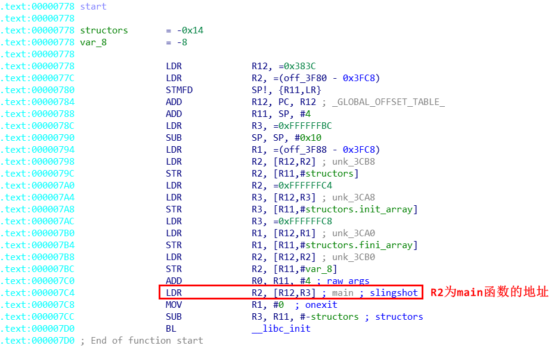

[toc]
# 0. 前言
## 0.1 如何确定main函数



# 1. 除法

## 1.1 x除以2^n
算法：
```
if(n >= 0){
    x >> n;
}else{
    (x + 2^n -1) >> n;
}
```
例子：
> int i = argc / 4;
对应的汇编代码
```
ASRS    R1, R0, #0x1F   ; R1=0或者R1=-1
LSRS    R1, R1, #0x1E   ; R1=0或者R1=3
ADDS    R1, R0, R1      ; r1 = r1 + r0
ASRS    R1, R1, #2      ; r1 >> 2
```

## 1.2 x除以-2^n
算法：
```
if(x >= 0)
    -(x >> n);
else
    -((x + 2^n -1) >> n);
```
例子:
> int i = argc / 4;
对应的汇编代码
```
ASRS    R1, R0, #0x1F
LSRS    R1, R1, #0x1E
ADDS    R0, R0, R1
ASRS    R0, R0, #2
NEGS    R1, R0          ;r1 = ^r0
```

## 1.3 x除以非2^n
### 1.3.1 第一种情况
算法：
```
if(x >=0)
    (x * MAGIC_NUM) >> (32 + n);
else
    (x * MAGIC_NUM) >> (32 + n) + 1;
``` 
> 除数o = 2^(32+n) / MAGIC_NUM;

例子：
```
i = argc / 3;   
i = argc / 5;   


MOV             R0, #0x55555556
SMMUL.W         R0, R4, R0
ADD.W           R1, R0, R0,LSR#31

o= 2^32 / 0x55555556;

MOV             R0, #0x66666667
SMMUL.W         R0, R4, R0
ASRS            R1, R0, #1
ADD.W           R1, R1, R0,LSR#31

o= 2^32 / 0x66666667;
``` 

### 1.3.2 第二种情况
算法：
```
    if (x >=0) 
        ((x * MAGIC_NUM) >> 32+x) >> n
    if (x < 0) 
        ((x * MAGIC_NUM) >> 32+x) >> n + 1
```
> 除数o = 2^(32+n) / MAGIC_NUM;

例子：
```
i = argc / 7;   o = 

MOV     R5, R0
MOV     R6, R0,ASR#31
LDR     R1, =2454267027
SMULL   R3, R1, R5, R1
ADD     R1, R1, R5
RSB     R1, R6, R1,ASR#2

o = 2^34 / 2454267027;
```

## 1.4 x除以负非2^n
### 1.4.1 第一种情况 
算法：
```
if(x >=0)
    -((x * MAGIC_NUM) >> (32 + n));
else
    -((x * MAGIC_NUM) >> (32 + n) + 1);
```
> 除数o = -2^(32+n) / MAGIC_NUM

例如: 
```
x / -3
LDR     R1, =1431655766
MOV     R6, R0,ASR#31
SMULL   R3, R1, R0, R1
RSB     R1, R1, R6

o= -2^32 / 1431655766;
```

### 1.4.2 第二种情况
算法：
```
    if (x >=0) 
        -(((x * MAGIC_NUM) >> 32+x) >> n)
    if (x < 0) 
        -(((x * MAGIC_NUM) >> 32+x) >> n + 1)
```
> 除数o = -2^(32+n) / MAGIC_NUM;

例子：
```
x / -7; 
MOV     R5, R0
MOV     R6, R0,ASR#31
LDR     R1, =2454267027
SMULL   R3, R1, R5, R1
ADD     R1, R1, R5
RSB     R1, R6, R1,ASR#2

o = -2^34 / 2454267027;
```

## 1.5. x为无符号数，除以2^n
算法：
```
x >> n
```
例子:
```
 x / 8
MOV     R1, R0,LSR#3
```

## 1.6. x为无符号数，除以非2^n
### 1.6.1 第一种情况 
算法：
```
(x * MAGIC_NUM)>>(32+n)
```
> 除数o = 2^(32+n) / MAGIC_NUM

例如: 
```
x / 3
LDR     R1, =0xAAAAAAAB
UMULL   R3, R1, R0, R1
MOV     R1, R1,LSR#1

```

### 1.6.2 第二种情况
算法：
```
(((x - (x*MAGIC_NUM) >> 32) >> i) + (x*MAGIC_NUM) >> 32) >> j
```
> 除数o = (2^(32 + i +j)) / (2^32 + MAGIC_NUM);

例如：
```
x / 7; 
LDR     R3, =0x24924925
UMULL   R2, R3, R0, R3
RSB     R1, R3, R0
ADD     R1, R3, R1,LSR#1
MOV     R1, R1,LSR#2
```

# 2. 分支结构
## 2.1 if...else if...else
c语言代码：
```cpp
if(argc > 1){
    printf("argc > 1");
}else if(argc == 1){
    printf("argc == 1");
}else{
    printf("argc < 1");
}
```
对应的ARMv7代码：
```
                CMP             R4, #2
                BLT             loc_5C0
                LDR             R0, =(aArgc1 - 0x5C0)
                ADD             R0, PC  ; "argc > 1"
                B               loc_5CE
; ---------------------------------------------------------------------------

loc_5C0                                 ; CODE XREF: main+4C↑j
                CMP             R4, #1
                BNE             loc_5CA
                LDR             R0, =(aArgc1_0 - 0x5CA)
                ADD             R0, PC  ; "argc == 1"
                B               loc_5CE
; ---------------------------------------------------------------------------

loc_5CA                                 ; CODE XREF: main+56↑j
                LDR             R0, =(aArgc1_1 - 0x5D0)
                ADD             R0, PC  ; "argc < 1"

loc_5CE                                 ; CODE XREF: main+52↑j
                                        ; main+5C↑j
                BLX             printf
                MOVS            R0, #0
                POP             {R4,R5,R7,PC}
```
在IDA中对应的结构：


## 2.2 switch...case
### 2.2.1 case后的值连续或间隔不大
C语言代码
```cpp
int main(int argc,char* argv[]){
	switch(argc){
	case 0:
		printf("argc = 0");
		break;
	case 1:
		printf("argc = 1");
		break;
	case 5:
		printf("argc = 5");
		break;
	case 6:
		printf("argc = 6");
		break;
	case 8:
		printf("argc = 8");
		break;
	case 9:
		printf("argc = 9");
		break;
	}
	return 0;
}
```
对应的ARMv7代码：
```
                PUSH            {R7,LR}
                MOV             R7, SP
                CMP             R0, #9  ; switch 10 cases
                BHI             def_574 ; jumptable 00000574 default case
                TBB.W           [PC,R0] ; switch jump
; ---------------------------------------------------------------------------
;使用做表的方式定位case块
jpt_574         DCB 5                   ; jump table for switch statement
                DCB 8
                DCB 0x18
                DCB 0x18
                DCB 0x18
                DCB 0xB
                DCB 0xE
                DCB 0x18
                DCB 0x11
                DCB 0x14
; ---------------------------------------------------------------------------

loc_582                                 ; CODE XREF: main+8↑j
                LDR             R0, =(aArgc0 - 0x588) ; jumptable 00000574 case 0
                ADD             R0, PC  ; "argc = 0"
                B               loc_5A4
; ---------------------------------------------------------------------------

loc_588                                 ; CODE XREF: main+8↑j
                LDR             R0, =(aArgc1 - 0x58E) ; jumptable 00000574 case 1
                ADD             R0, PC  ; "argc = 1"
                B               loc_5A4
; ---------------------------------------------------------------------------

loc_58E                                 ; CODE XREF: main+8↑j
                LDR             R0, =(aArgc5 - 0x594) ; jumptable 00000574 case 5
                ADD             R0, PC  ; "argc = 5"
                B               loc_5A4
; ---------------------------------------------------------------------------

loc_594                                 ; CODE XREF: main+8↑j
                LDR             R0, =(aArgc6 - 0x59A) ; jumptable 00000574 case 6
                ADD             R0, PC  ; "argc = 6"
                B               loc_5A4
; ---------------------------------------------------------------------------

loc_59A                                 ; CODE XREF: main+8↑j
                LDR             R0, =(aArgc8 - 0x5A0) ; jumptable 00000574 case 8
                ADD             R0, PC  ; "argc = 8"
                B               loc_5A4
; ---------------------------------------------------------------------------

loc_5A0                                 ; CODE XREF: main+8↑j
                LDR             R0, =(aArgc9 - 0x5A6) ; jumptable 00000574 case 9
                ADD             R0, PC  ; "argc = 9"

loc_5A4                                 ; CODE XREF: main+1A↑j
                                        ; main+20↑j ...
                BLX             printf

def_574                                 ; CODE XREF: main+6↑j
                                        ; main+8↑j
                MOVS            R0, #0  ; jumptable 00000574 default case
                POP             {R7,PC}
; End of function main

; ---------------------------------------------------------------------------
off_5AC         DCD aArgc9 - 0x5A6      ; DATA XREF: main:loc_5A0↑r
                                        ; "argc = 9"
off_5B0         DCD aArgc8 - 0x5A0      ; DATA XREF: main:loc_59A↑r
                                        ; "argc = 8"
off_5B4         DCD aArgc6 - 0x59A      ; DATA XREF: main:loc_594↑r
                                        ; "argc = 6"
off_5B8         DCD aArgc5 - 0x594      ; DATA XREF: main:loc_58E↑r
                                        ; "argc = 5"
off_5BC         DCD aArgc1 - 0x58E      ; DATA XREF: main:loc_588↑r
                                        ; "argc = 1"
off_5C0         DCD aArgc0 - 0x588      ; DATA XREF: main:loc_582↑r
; } // starts at 56C                    ; "argc = 0"
``` 
在IDA中对应的结构：


### 2.2.2 case后的值间隔较大时
C语言代码：
```cpp
#include<stdio.h>

int main(int argc,char* argv[]){

	switch(argc){
	case 0:
		printf("argc = 0");
		break;
	case 30:
		printf("argc = 30");
		break;
	case 50:
		printf("argc = 50");
		break;
	case 80:
		printf("argc = 80");
		break;
	case 100:
		printf("argc = 100");
		break;
	case 200:
		printf("argc = 200");
		break;
	}
	return 0;
}
```
对应的ARMv7代码：
```
                PUSH            {R7,LR}
                MOV             R7, SP
                CMP             R0, #79
                BGT             loc_584
                CBZ             R0, loc_596
                CMP             R0, #0x1E
                BEQ             loc_59C
                CMP             R0, #50
                BNE             loc_5B0
                LDR             R0, =(aArgc50 - 0x584)
                ADD             R0, PC  ; "argc = 50"
                B               loc_5AC
; ---------------------------------------------------------------------------

loc_584                                 ; CODE XREF: main+6↑j
                CMP             R0, #80
                BEQ             loc_5A2
                CMP             R0, #100
                BEQ             loc_5A8
                CMP             R0, #200
                BNE             loc_5B0
                LDR             R0, =(aArgc200 - 0x596)
                ADD             R0, PC  ; "argc = 200"
                B               loc_5AC
; ---------------------------------------------------------------------------

loc_596                                 ; CODE XREF: main+8↑j
                LDR             R0, =(aArgc0 - 0x59C)
                ADD             R0, PC  ; "argc = 0"
                B               loc_5AC
; ---------------------------------------------------------------------------

loc_59C                                 ; CODE XREF: main+C↑j
                LDR             R0, =(aArgc30 - 0x5A2)
                ADD             R0, PC  ; "argc = 30"
                B               loc_5AC
; ---------------------------------------------------------------------------

loc_5A2                                 ; CODE XREF: main+1A↑j
                LDR             R0, =(aArgc80 - 0x5A8)
                ADD             R0, PC  ; "argc = 80"
                B               loc_5AC
; ---------------------------------------------------------------------------

loc_5A8                                 ; CODE XREF: main+1E↑j
                LDR             R0, =(aArgc100 - 0x5AE)
                ADD             R0, PC  ; "argc = 100"

loc_5AC                                 ; CODE XREF: main+16↑j
                                        ; main+28↑j ...
                BLX             printf

loc_5B0                                 ; CODE XREF: main+10↑j
                                        ; main+22↑j
                MOVS            R0, #0
                POP             {R7,PC}
```
IDA中对应的结构：


## 2.3 循环结构
### 2.3.1  do...while
C语言代码：
```cpp
#include<stdio.h>

int main(int argc,char* argv[]){

	do{
		printf("argc = %d\r\n", argc);
		argc++;
	}while(argc < 9);
}
```
对应的ARMv7代码：
```
                 PUSH            {R4,R5,R7,LR}
                 ADD             R7, SP, #8
                 LDR             R5, =(aArgcD - 0x578)
                 MOV             R4, R0
                 ADD             R5, PC  ; "argc = %d\r\n"

 loc_576                                 ; CODE XREF: main+16↓j
                 MOV             R0, R5  ; format
                 MOV             R1, R4
                 BLX             printf
                 ADDS            R4, #1
                 CMP             R4, #9
                 BLT             loc_576
                 MOVS            R0, #0
                 POP             {R4,R5,R7,PC}
```
IDA中对应的结构：


### 2.3.2  while
C语言代码：
```
int main(int argc,char* argv[]){

	while(argc < 9){
		printf("argc = %d\r\n", argc);
		argc++;
	};
}
```
对应的ARMv7代码：
```
                 PUSH            {R4,R5,R7,LR}
                 ADD             R7, SP, #8
                 MOV             R4, R0
                 CMP             R4, #8
                 BGT             loc_588
                 LDR             R5, =(aArgcD - 0x57C)
                 ADD             R5, PC  ; "argc = %d\r\n"

 loc_57A                                 ; CODE XREF: main+1A↓j
                 MOV             R0, R5  ; format
                 MOV             R1, R4
                 BLX             printf
                 ADDS            R4, #1
                 CMP             R4, #9
                 BNE             loc_57A

 loc_588                                 ; CODE XREF: main+8↑j
                 MOVS            R0, #0
                 POP             {R4,R5,R7,PC}
```
IDA中对应的结构：


### 2.3.3 for 
c语言代码：
```cpp
int main(int argc,char* argv[]){

	for(int i = 0; i < 9; i++){
		printf("for");
	}
}
```
对应的ARMv7代码：
```
                 PUSH            {R4,R5,R7,LR}
                 ADD             R7, SP, #8
                 LDR             R4, =(aFor - 0x578)
                 MOVS            R5, #9
                 ADD             R4, PC  ; "for"

 loc_576                                 ; CODE XREF: main+12↓j
                 MOV             R0, R4  ; format
                 BLX             printf
                 SUBS            R5, #1
                 BNE             loc_576
                 MOVS            R0, #0
                 POP             {R4,R5,R7,PC}
```
IDA中对应的结构：


# 3.类
## 3.1 普通类
C++代码:
```cpp
//CBase.h
class CBase{
public:
    CBase(int n1, int n2);
    ~CBase();
    void fun1(int n);
    void fun2(int n);
public:
    int m_nMember1;
    int m_nMember2;
};

//CBase.cpp
#include<stdio.h>
#include "CBase.h"

CBase::CBase(int n1, int n2) {
    m_nMember1 = n1;
    m_nMember2 = n2;
    printf("CBase()\r\n");
}
CBase::~CBase() {
    m_nMember1 = 0;
    m_nMember2 = 0;
    printf("~CBase()\r\n");
}
void CBase::fun1(int n) {
    printf("CBase::fun1(), %d\r\n", n*m_nMember1*m_nMember2);
}
void CBase::fun2(int n) {
    printf("CBase::fun2(), %d\r\n", n*m_nMember1*m_nMember2);
}

//main.cpp
#include <stdio.h>
#include "CBase.h"

int main(int argc, char* argv[]){
    CBase base(2, 3);
    base.fun2(argc);
    CBase* pbase = new CBase(4, 5);
    if(pbase != NULL)
        pbase->fun1(argc);
    delete pbase;
}
``` 
对应ARMv7代码：
```
PUSH            {R4-R7,LR}
ADD             R7, SP, #0xC
SUB             SP, SP, #0xC
MOV             R5, R0
LDR             R0, =(__stack_chk_guard_ptr - 0xB1C4371E)
MOV             R4, SP
MOVS            R1, #2
ADD             R0, PC  ; __stack_chk_guard_ptr
MOVS            R2, #3
LDR             R0, [R0]
LDR             R0, [R0]
STR             R0, [SP,#0x18+var_10]
MOV             R0, R4       ;使用栈保存类成员变量
BL              sub_B1C4369C ; 构造函数
MOV             R0, R4
MOV             R1, R5
BL              sub_B1C436F0
MOVS            R0, #8  ; unsigned int
BLX             _Znwj   ; operator new(uint)
MOVS            R1, #4
MOVS            R2, #5
MOV             R6, R0  ;R0指向类成员变量
BL              sub_B1C4369C
MOV             R0, R6
MOV             R1, R5
BL              sub_B1C436D4
MOV             R0, R6
BL              sub_B1C436B8
MOV             R0, R6  ; void *
BLX             _ZdlPv  ; operator delete(void *)
MOV             R0, R4
BL              sub_B1C436B8
LDR             R0, =(__stack_chk_guard_ptr - 0xB1C43764)
LDR             R1, [SP,#0x18+var_10]
ADD             R0, PC  ; __stack_chk_guard_ptr
LDR             R0, [R0]
LDR             R0, [R0]
SUBS            R0, R0, R1
ITTT EQ
MOVEQ           R0, #0
ADDEQ           SP, SP, #0xC
POPEQ           {R4-R7,PC}
BLX             __stack_chk_fail
```

## 3.2 单重继承
C++代码：
```cpp
//CBase.h
#include<stdio.h>

class CBase {
public:
    CBase();
    virtual ~CBase();
    virtual void fun1();
    virtual void fun2();
private:
    int m_nMember1;
    int m_nMember2;
};

//CBase.cpp
#include "CBase.h"

CBase::CBase() {
    m_nMember1 = 1;
    m_nMember2 = 2;
    printf("CBase()\r\n");
}
CBase::~CBase() {
    printf("~CBase()\r\n");
}
void CBase::fun1() {
    printf("CBase::fun1()\r\n");
}
void CBase::fun2() {
    printf("CBase::fun2()\r\n");
}

//CDerived.h
#include "CBase.h"
class CDerived :public CBase{
public:
    CDerived();
    virtual ~CDerived();
    virtual void fun1();
    virtual void fun3();
private:
    int m_nMember;
};

//CDerived.cpp
#include"CDerived.h"

CDerived::CDerived() {
    m_nMember = 3;
    printf("CDerived()\r\n");
}
CDerived::~CDerived() {
    printf("~CDerived()\r\n");
}
void CDerived::fun1() {
    printf("CDerived::fun1()\r\n");
}
void CDerived::fun3() {
    printf("CDerived::fun3()\r\n");
}

//main.cpp
#include "CDerived.h"

int main(int argc, char* argv[]){
    CDerived base;
    base.fun2();
    CBase* pbase = new CDerived;
    if(pbase != NULL)
        pbase->fun1();
    delete pbase;
}
```
> 执行顺序：先构造基类，再构造自己，析构自己，在析构基类

构造函数ARMv7代码：
```
PUSH            {R4,R6,R7,LR}
ADD             R7, SP, #8
MOV             R4, R0
BL              sub_B109068C ; 基类构造
LDR             R0, =(off_B1093FA8 - 0xB1090794)
ADD             R0, PC  ; off_B1093FA8
LDR             R1, [R0] ; dword_B1093E50
LDR             R0, =(aCderived - 0xB109079E)
ADDS            R1, #8
STR             R1, [R4] ; 填充虚表指针
ADD             R0, PC  ; "CDerived()\r"
MOVS            R1, #3
STR             R1, [R4,#0xC]
BLX             puts
MOV             R0, R4
POP             {R4,R6,R7,PC}
``` 

内存结构：


析构函数对应ARMv7代码：
```
PUSH            {R4,R6,R7,LR}
ADD             R7, SP, #8
MOV             R4, R0
LDR             R0, =(off_B1093FA8 - 0xB10907BC)
ADD             R0, PC  ; off_B1093FA8
LDR             R1, [R0] ; dword_B1093E50
LDR             R0, =(aCderived_0 - 0xB10907C6)
ADDS            R1, #8
STR             R1, [R4] ; 填充虚表指针
ADD             R0, PC  ; "~CDerived()\r"
BLX             puts
MOV             R0, R4
POP.W           {R4,R6,R7,LR}
B.W             sub_B10906B8 ; 调用基类析构函数
```
代理析构函数对应ARMv7代码：
```
PUSH            {R4,R6,R7,LR}
ADD             R7, SP, #8
MOV             R4, R0
LDR             R0, =(off_B1093FA8 - 0xB10907E8)
ADD             R0, PC  ; off_B1093FA8
LDR             R1, [R0] ; dword_B1093E50
LDR             R0, =(aCderived_0 - 0xB10907F2)
ADDS            R1, #8
STR             R1, [R4] ; 填充虚表指针
ADD             R0, PC  ; "~CDerived()\r"
BLX             puts
MOV             R0, R4
BL              sub_B10906B8 ; 调用基类的析构函数
MOV             R0, R4  ; void *
POP.W           {R4,R6,R7,LR}
B.W             j__ZdlPv ; operator delete(void *)
```

## 3.3多重继承
### 3.3.1 包含虚函数的多重继承
C++代码：
```cpp
//CBase.h
#include<stdio.h>

class CBase {
public:
    CBase();
    virtual ~CBase();
    virtual void fun1();
    virtual void fun2();
private:
    int m_nMember1;
    int m_nMember2;
};

//CBase.cpp
#include "CBase.h"

CBase::CBase() {
    m_nMember1 = 1;
    m_nMember2 = 2;
    printf("CBase()\r\n");
}
CBase::~CBase() {
    printf("~CBase()\r\n");
}
void CBase::fun1() {
    printf("CBase::fun1()\r\n");
}
void CBase::fun2() {
    printf("CBase::fun2()\r\n");
}

//CDerived.h
#include "CBase.h"
class CDerived :public CBase{
public:
    CDerived();
    virtual ~CDerived();
    virtual void fun1();
    virtual void fun3();
private:
    int m_nMember;
};

//CDerived.cpp
#include"CDerived.h"

CDerived::CDerived() {
    m_nMember = 3;
    printf("CDerived()\r\n");
}
CDerived::~CDerived() {
    printf("~CDerived()\r\n");
}
void CDerived::fun1() {
    printf("CDerived::fun1()\r\n");
}
void CDerived::fun3() {
    printf("CDerived::fun3()\r\n");
}

//CDerived.h
#include "CDerived.h"

class CDerived2 :public CDerived{
public:
	CDerived2();
	virtual ~CDerived2();
	virtual void fun1();
	virtual void fun2();
	virtual void fun3();
private:
	int m_nMember;
};

//CDerived2.cpp
#include "CDerived2.h"

CDerived2::CDerived2() {
	m_nMember = 3;
	printf("CDerived2()\r\n");
}
CDerived2::~CDerived2() {
	printf("~CDerived2()\r\n");
}
void CDerived2::fun1() {
	printf("CDerived2::fun1()\r\n");
}
void CDerived2::fun2(){
	printf("CDerived2::fun2()\r\n");
}
void CDerived2::fun3() {
	printf("CDerived2::fun3()\r\n");
}

//main.cpp
#include "CDerived2.h"

int main(int argc, char* argv[]){
	CDerived2 base;
	base.fun2();
	CBase* pbase = new CDerived2;
	if(pbase != NULL)
		pbase->fun1();
	delete pbase;
}
```
构造函数对应ARMv7代码：
```
PUSH            {R4,R6,R7,LR}
ADD             R7, SP, #8
MOV             R4, R0
BL              sub_7B0 ; 构造基类
LDR             R0, =(off_3FA8 - 0x860)
ADD             R0, PC  ; off_3FA8
LDR             R1, [R0] ; dword_3E4C
LDR             R0, =(aCderived2 - 0x86A)
ADDS            R1, #8
STR             R1, [R4] ; 填充虚表指针
ADD             R0, PC  ; "CDerived2()\r"
MOVS            R1, #3
STR             R1, [R4,#0x10]
BLX             puts
MOV             R0, R4
POP             {R4,R6,R7,PC}
```
析构函数对应ARMv7代码：
```
PUSH            {R4,R6,R7,LR}
ADD             R7, SP, #8
MOV             R4, R0
LDR             R0, =(off_3FA8 - 0x888)
ADD             R0, PC  ; off_3FA8
LDR             R1, [R0] ; dword_3E4C
LDR             R0, =(aCderived2_0 - 0x892)
ADDS            R1, #8
STR             R1, [R4] ; 填充虚表
ADD             R0, PC  ; "~CDerived2()\r"
BLX             puts
MOV             R0, R4
POP.W           {R4,R6,R7,LR}
B.W             sub_7DC ; 调用基类析构
```
代理析构函数对应ARMv7代码：
```
PUSH            {R4,R6,R7,LR}
ADD             R7, SP, #8
MOV             R4, R0
LDR             R0, =(off_3FA8 - 0x8B4)
ADD             R0, PC  ; off_3FA8
LDR             R1, [R0] ; dword_3E4C
LDR             R0, =(aCderived2_0 - 0x8BE)
ADDS            R1, #8
STR             R1, [R4] ; 填充虚表指针
ADD             R0, PC  ; "~CDerived2()\r"
BLX             puts
MOV             R0, R4
BL              sub_7DC ; 调用基类析构
MOV             R0, R4  ; void *
POP.W           {R4,R6,R7,LR}
B.W             j__ZdlPv ; operator delete(void *)
```
识别方法：


### 3.3.2 不包含虚函数的多重继承
C++代码：
```cpp
//CBase.h
#include<stdio.h>

class CBase {
public:
    CBase();
    ~CBase();
    void fun1();
    void fun2();
private:
    int m_nMember1;
    int m_nMember2;
};

//CBase.cpp
#include "CBase.h"

CBase::CBase() {
    m_nMember1 = 1;
    m_nMember2 = 2;
    printf("CBase()\r\n");
}
CBase::~CBase() {
    printf("~CBase()\r\n");
}
void CBase::fun1() {
    printf("CBase::fun1()\r\n");
}
void CBase::fun2() {
    printf("CBase::fun2()\r\n");
}

//CDerived.h
#include "CBase.h"
class CDerived :public CBase{
public:
    CDerived();
    ~CDerived();
    void fun1();
    void fun3();
private:
    int m_nMember;
};

//CDerived.cpp
#include"CDerived.h"

CDerived::CDerived() {
    m_nMember = 3;
    printf("CDerived()\r\n");
}
CDerived::~CDerived() {
    printf("~CDerived()\r\n");
}
void CDerived::fun1() {
    printf("CDerived::fun1()\r\n");
}
void CDerived::fun3() {
    printf("CDerived::fun3()\r\n");
}

//CDerived.h
#include "CDerived.h"

class CDerived2 :public CDerived{
public:
	CDerived2();
	~CDerived2();
	void fun1();
	void fun2();
	void fun3();
private:
	int m_nMember;
};

//CDerived2.cpp
#include "CDerived2.h"

CDerived2::CDerived2() {
	m_nMember = 3;
	printf("CDerived2()\r\n");
}
CDerived2::~CDerived2() {
	printf("~CDerived2()\r\n");
}
void CDerived2::fun1() {
	printf("CDerived2::fun1()\r\n");
}
void CDerived2::fun2(){
	printf("CDerived2::fun2()\r\n");
}
void CDerived2::fun3() {
	printf("CDerived2::fun3()\r\n");
}

//main.cpp
#include "CDerived2.h"

int main(int argc, char* argv[]){
	CDerived2 base;
    //可以调用基类的所有函数
	base.fun1();
	base.fun2();
	base.fun3();
	CBase* pbase = new CDerived2;
	if(pbase != NULL)
		pbase->fun1();
		pbase->fun2();
        //pbase->fun3(); 错误，基类指针无法调用子类方法
	delete pbase;
}
```
不包含虚函数的多重继承在C++代码中基本不存在意义，所以逆向过程中根据自己的喜好进行逆向就好。

## 4 菱形继承
C++代码：
```

```