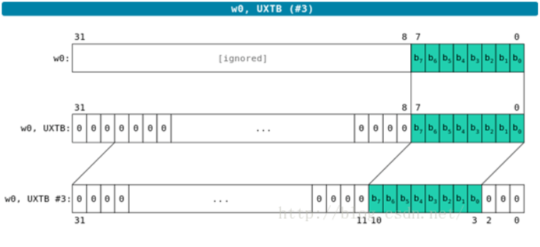

# 1. ARMv8寄存器

寄存器名称描述

| 位宽   | 分类       |                |                 |
| ------ | ---------- | -------------- | --------------- |
| 32-bit | Wn（通用） | WZR（0寄存器） | WSP（堆栈指针） |
| 64-bit | Xn（通用） | XZR（0寄存器） | SP（堆栈指针）  |

## 1.1. AArch32重要寄存器


| 寄存器类型 | Bit   | 描述                                                                                                                                                                                                                           |
| ---------- | ----- | ------------------------------------------------------------------------------------------------------------------------------------------------------------------------------------------------------------------------------ |
| R0-R14     | 32bit | 通用寄存器，但是ARM不建议使用有特殊功能的R13，R14，R15当做通用寄存器使用.                                                                                                                                                      |
| SP_x       | 32bit | 通常称R13为堆栈指针，除了User和Sys模式外，其他各种模式下都有对应的SP_x寄存器：x ={ und/svc/abt/irq/fiq/hyp/mon}                                                                                                                |
| LR_x       | 32bit | 称R14为链接寄存器，除了User和Sys模式外，其他各种模式下都有对应的SP_x寄存器：x ={ und/svc/abt/svc/irq/fiq/mon},用于保存程序返回链接信息地址，AArch32环境下，也用于保存异常返回地址，也就说LR和ELR是公用一个，AArch64下是独立的. |
| ELR_hyp    | 32bit | Hyp mode下特有的异常链接寄存器，保存异常进入Hyp mode时的异常地址                                                                                                                                                               |
| PC         | 32bit | 通常称R15为程序计算器PC指针，AArch32 中PC指向取指地址，是执行指令地址+8，AArch64中PC读取时指向当前指令地址.                                                                                                                    |
| CPSR       | 32bit | 记录当前PE的运行状态数据,CPSR.M[4:0]记录运行模式，AArch64下使用PSTATE代替                                                                                                                                                      |
| APSR       | 32bit | 应用程序状态寄存器，EL0下可以使用APSR访问部分PSTATE值                                                                                                                                                                          |
| SPSR_x     | 32bit | 是CPSR的备份，除了User和Sys模式外，其他各种模式下都有对应的SPSR_x寄存器：x ={ und/svc/abt/irq/fiq/hpy/mon}，注意：这些模式只适用于32bit运行环境                                                                                |
| HCR        | 32bit | EL2特有，HCR.{TEG,AMO,IMO,FMO,RW}控制EL0/EL1的异常路由                                                                                                                                                                         |
| SCR        | 32bit | EL3特有，SCR.{EA,IRQ,FIQ,RW}控制EL0/EL1/EL2的异常路由，注意EL3始终不会路由                                                                                                                                                     |
| VBAR       | 32bit | 保存任意异常进入非Hyp mode & 非Monitor mode的跳转向量基地址                                                                                                                                                                    |
| HVBAR      | 32bit | 保存任意异常进入Hyp mode的跳转向量基地址                                                                                                                                                                                       |
| MVBAR      | 32bit | 保存任意异常进入Monitor mode的跳转向量基地址                                                                                                                                                                                   |
| ESR_ELx    | 32bit | 保存异常进入ELx时的异常综合信息，包含异常类型EC等，可以通过EC值判断异常class                                                                                                                                                   |
| PSTATE     |       | 不是一个寄存器，是保存当前PE状态的一组寄存器统称，其中可访问寄存器有：PSTATE.{NZCV,DAIF,CurrentEL,SPSel},属于ARMv8新增内容，主要用于64bit环境下                                                                                |

### 1.1.1. A32状态下寄存器组织


> 所谓的banked register 是指一个寄存器在不同模式下有对应不同的寄存器，比如SP，在abort模式下是SP_bat，在Und模式是SP_und,在iqr模式下是SP_irq等，进入各种模式后会自动切换映射到各个模式下对应的寄存器.
>
> R0-R7是所谓的非banked register，R8-R14是所谓的banked register

### 1.1.2. T32状态下寄存器组织

| A32使用Rd/Rn编码位宽4位 | T32-32bit使用Rd/Rn编码位宽4位 | T32-16bit使用Rd/Rn编码位宽3位                                                                             |
| ----------------------- | ----------------------------- | --------------------------------------------------------------------------------------------------------- |
| R0                      | R0                            | R0                                                                                                        |
| R1                      | R1                            | R1                                                                                                        |
| R2                      | R2                            | R2                                                                                                        |
| R3                      | R3                            | R3                                                                                                        |
| R4                      | R4                            | R4                                                                                                        |
| R5                      | R5                            | R5                                                                                                        |
| R6                      | R6                            | R6                                                                                                        |
| R7                      | R7                            | R7                                                                                                        |
| R8                      | R8                            | 并不是说T32-16bit下没有R8～R12，而是有限的指令才能访问到,16bit指令的Rd/Rn编码位只有3位，所以Rx范围是R0-R7 |
| R9                      | R9                            |                                                                                                           |
| R10                     | R10                           |                                                                                                           |
| R11                     | R11                           |                                                                                                           |
| R12                     | R12                           |                                                                                                           |
| SP (R13)                | SP (R13)                      | SP (R13)                                                                                                  |
| LR (R14)                | LR (R14) //M                  | LR (R14) //M                                                                                              |
| PC (R15)                | PC (R15) //P                  | PC (R15) //P                                                                                              |
| CPSR                    | CPSR                          | CPSR                                                                                                      |
| SPSR                    | SPSR                          | SPSR                                                                                                      |

## 1.2. AArch64重要寄存器

| 寄存器类型 | Bit   | 描述                                                                                                                                       |
| ---------- | ----- | ------------------------------------------------------------------------------------------------------------------------------------------ |
| X0-X30     | 64bit | 通用寄存器，如果有需要可以当做32bit使用：WO-W30                                                                                            |
| LR (X30)   | 64bit | 通常称X30为程序链接寄存器，保存跳转返回信息地址                                                                                            |
| SP_ELx     | 64bit | 若PSTATE.M[0] ==1，则每个ELx选择SP_ELx，否则选择同一个SP_EL0                                                                               |
| ELR_ELx    | 64bit | 异常链接寄存器，保存异常进入ELx的异常地址（x={0,1,2,3}）                                                                                   |
| PC         | 64bit | 程序计数器，俗称PC指针，总是指向即将要执行的下一条指令                                                                                     |
| SPSR_ELx   | 32bit | 寄存器，保存进入ELx的PSTATE状态信息                                                                                                        |
| NZCV       | 32bit | 允许访问的符号标志位                                                                                                                       |
| DIAF       | 32bit | 中断使能位：D-Debug，I-IRQ，A-SError，F-FIQ ，逻辑0允许                                                                                    |
| CurrentEL  | 32bit | 记录当前处于哪个Exception level                                                                                                            |
| SPSel      | 32bit | 记录当前使用SP_EL0还是SP_ELx，x= {1,2,3}                                                                                                   |
| HCR_EL2    | 32bit | HCR_EL2.{TEG,AMO,IMO,FMO,RW}控制EL0/EL1的异常路由 逻辑1允许                                                                                |
| SCR_EL3    | 32bit | SCR_EL3.{EA,IRQ,FIQ,RW}控制EL0/EL1/EL2的异常路由  逻辑1允许                                                                                |
| ESR_ELx    | 32bit | 保存异常进入ELx时的异常综合信息，包含异常类型EC等.                                                                                         |
| VBAR_ELx   | 64bit | 保存任意异常进入ELx的跳转向量基地址 x={0,1,2,3}                                                                                            |
| STATE      |       | 不是一个寄存器，是保存当前PE状态的一组寄存器统称，其中可访问寄存器有：PSTATE.{NZCV,DAIF,CurrentEL,SPSel},属于ARMv8新增内容,64bit下代替CPSR |

## 1.3. 、32位寄存器的映射关系

| 64-bit   | 32-bit  |
| -------- | ------- |
| X0       | R0      |
| X1       | R1      |
| X2       | R2      |
| X3       | R3      |
| X4       | R4      |
| X5       | R5      |
| X6       | R6      |
| X7       | R7      |
| X8       | R8_usr  |
| X9       | R9_usr  |
| X20      | LR_adt  |
| X10      | R10_usr |
| X11      | R11_usr |
| X12      | R12_usr |
| X13      | SP_usr  |
| X14      | LR_usr  |
| X15      | SP_hyp  |
| X16      | LR_irq  |
| X17      | SP_irq  |
| X18      | LR_svc  |
| X19      | SP_svc  |
| X21      | SP_abt  |
| X22      | LR_und  |
| X23      | SP_und  |
| X24      | R8_fiq  |
| X25      | R9_fiq  |
| X26      | R10_fiq |
| X27      | R11_fiq |
| X28      | R12_fiq |
| X29      | SP_fiq  |
| X30(LR)  | LR_fiq  |
| SCR_EL3  | SCR     |
| HCR_EL2  | HCR     |
| VBAR_EL1 | VBAR    |
| VBAR_EL2 | HVBAR   |
| VBAR_EL3 | MVBAR   |
| ESR_EL1  | DFSR    |
| ESR_EL2  | HSR     |


# 2. ARMv8指令集

## 2.1. 指令基本格式
```
<Opcode>{<Cond>}<S>  <Rd>, <Rn> {,<Opcode2>}
```
* 其中尖括号是必须的，花括号是可选的
* A32： Rd => {R0–R14}  
* A64： Rd =>Xt => {X0–X30}

| 标识符    | Note                                                                                                               |
| --------- | ------------------------------------------------------------------------------------------------------------------ |
| `Opcode`  | 操作码，也就是助记符，说明指令需要执行的操作类型                                                                   |
| `Cond`    | 指令执行条件码，在编码中占 `4bit`，`0b0000` - `0b1110`                                                             |
| `S`       | 条件码设置项,决定本次指令执行是否影响 `PSTATE` 寄存器响应状态位值                                                  |
| `Rd/Xt`   | 目标寄存器，`A32` 指令可以选择 `R0-R14` , `T32` 指令大部分只能选择 `RO-R7` ，`A64` 指令可以选择 `X0-X30 or W0-W30` |
| `Rn/Xn`   | 第一个操作数的寄存器，和Rd一样，不同指令有不同要求                                                                 |
| `Opcode2` | 第二个操作数，可以是立即数，寄存器Rm和寄存器移位方式（`Rm` ，`#shit` ）                                            |

## 2.2. 指令分类
| 类型                      | Note                                                                                                                                             |
| ------------------------- | ------------------------------------------------------------------------------------------------------------------------------------------------ |
| 跳转指令                  | 条件跳转、无条件跳转（`#imm、register`）指令                                                                                                     |
| 异常产生指令              | 系统调用类指令（`SVC` 、`HVC` 、`SMC`）                                                                                                          |
| 系统寄存器指令            | 读写系统寄存器，如 ：`MRS` 、`MSR`指令 可操作 `PSTATE` 的位段寄存器                                                                              |
| 数据处理指令              | 包括各种算数运算、逻辑运算、位操作、移位(shift)指令                                                                                              |
| `load/store` 内存访问指令 | `load/store` {批量寄存器、单个寄存器、一对寄存器、非-暂存、非特权、独占}以及 `load-Acquire` 、`store-Release` 指令 （`A64` 没有 `LDM/STM` 指令） |
| 协处理指令                | `A64` 没有协处理器指令                                                                                                                           |

## 2.3. A64指令集
 * `A64` 指令编码宽度固定 `32bit` .
 * `31` 个（ `X0-X30` ）个 `64bit` 通用用途寄存器（用作 `32bit` 时是 `W0-W30` ），寄存器名使用 `5bit` 编码.
 * `PC` 指针不能作为数据处理指或 `load` 指令的目的寄存器， `X30` 通常用作 `LR` .
 * 移除了批量加载寄存器指令 `LDM/STM, PUSH/POP` , 使用 `STP/LDP` 一对加载寄存器指令代替.
 * 增加支持未对齐的 `load/store` 指令立即数偏移寻址，提供非-暂存 `LDNP/STNP` 指令，不需要 `hold` 数据到 `cache` 中.
 * 没有提供访问 `CPSR` 的单一寄存器，但是提供访问 `PSTATE` 的状态域寄存器.
 * 相比 `A32` 少了很多条件执行指令，只有条件跳转和少数数据处理这类指令才有条件执行.
 * 支持 `48bit` 虚拟寻址空间.
* `大部分 `A64` 指令都有 `32/64` 位两种形式.
 * `A64` 没有协处理器的概念.

### 2.3.1. 指令助记符
**整型**

| `W/R` | `32bit` 整数 |
| ----- | ------------ |
| `X`   | `64bit` 整数 |

**加载/存储、符号-0扩展**

| `B`  | 无符号`8bit`字节  |
| ---- | ----------------- |
| `SB` | 带符号`8bit`字节  |
| `H`  | 无符号`16bit`半字 |
| `SH` | 带符号`16bit`半字 |
| `W`  | 无符号`32bit`字   |
| `SW` | 带符号`32bit`字   |
| `P`  | `Pair`（一对）    |

**寄存器宽度改变**

| `H` | 高位（`dst gets top half`）          |
| --- | ------------------------------------ |
| `N` | 有限位（`dst < src`）                |
| `L` | `Long` （`dst > src`）               |
| `W` | `Wide` (`dst == src1`,`src1 > src2`) |

### 2.3.2. 指令条件码

| 编码   | 助记符  | 描述                                 | 标记               |
| ------ | ------- | ------------------------------------ | ------------------ |
| `0000` | `EQ`    | 运算结果相等为 `1`                   | `Z==1`             |
| `0001` | `NE`    | 运算结果不等为 `0`                   | `Z==0`             |
| `0010` | `HS/CS` | 无符号高或者相同进位，发生进位为 `1` | `C==1`             |
| `0011` | `LO/CC` | 无符号低清零，发生借位为 `0`         | `C==0`             |
| `0100` | `MI`    | 负数为 `1`                           | `N==1`             |
| `0101` | `PL`    | 非负数 `0`                           | `N==0`             |
| `0110` | `VS`    | 有符号溢出为 `1`                     | `V==1`             |
| `0111` | `VC`    | 没用溢出为 `0`                       | `V==0`             |
| `1000` | `HI`    | 无符号 `>`                           | `C==1 && Z==0`     |
| `1001` | `LS`    | 无符号 `<=`                          | `(C = 0) || (Z = 1)`  |
| `1010` | `GE`    | 带符号 `>=`                          | `N==V`             |
| `1011` | `LT`    | 带符号 `<`                           | `N!=V `            |
| `1100` | `GT`    | 带符号 `>`                           | `Z==0 && N==V`     |
| `1101` | `LE`    | 带符号 `<=`                          | `!(Z==1) || (N!=V)` |
| `1110` | `AL`    | 无条件执行                           | `Any`              |
| `1111` | `NV`    | 无条件执行                           | `Any`              |

### 2.3.3. 跳转指令
#### 2.3.3.1. 条件跳转
| `B.cond` | `cond` 为真跳转                                       |
| -------- | ----------------------------------------------------- |
| `CBNZ`   | `CBNZ X1，label`    //如果 `X1!= 0` 则跳转到 `label`  |
| `CBZ`    | `CBZ X1，label`     //如果 `X1== 0` 则跳转到 `label`  |
| `TBNZ`   | `TBNZ X1，#3 label` //若 `X1[3]!=0` ,则跳转到 `label` |
| `TBZ`    | `TBZ X1，#3 label`  //若` X1[3]==0` ,则跳转到 `label` |

#### 2.3.3.2. 绝对跳转
| `B`   | 绝对跳转                                    |
| --- | ------------------------------------------- |
| `BL`  | 绝对跳转 `#imm` ，返回地址保存到`LR`(`X30`)      |
| `BLR` | 绝对跳转 `reg` ，返回地址保存到`LR`(`X30`)        |
| `BR`  | 跳转到 `reg` 内容地址,                          |
| `RET` | 子程序返回指令，返回地址默认保存在 `LR`(`X30`) |

### 2.3.4. 异常产生和返回指令
| `SVC`  | `SVC` 系统调用，目标异常等级为 `EL1`         |
| ------ | -------------------------------------------- |
| `HVC`  | `HVC` 系统调用，目标异常等级为 `EL2`         |
| `SMC`  | `SMC` 系统调用，目标异常等级为 `EL3`         |
| `ERET` | 异常返回，使用当前的 `SPSR_ELx` 和 `ELR_ELx` |

### 2.3.5. 系统寄存器指令
| `MRS` | `R <- S`: 通用寄存器 <= 系统寄存器 |
| ----- | ---------------------------------- |
| `MSR` | `S <- R`: 系统寄存器 <= 通用寄存器 |

### 2.3.6. 数据处理指令
| 算数运算 | 逻辑运算 | 数据传输 | 地址生成 | 位段移动 | 移位运算 |
| -------- | -------- | -------- | -------- | -------- | -------- |
| `ADDS`   | `ANDS`   | `MOV`    | `ADRP`   | `BFM`    | `ASR`    |
| `SUBS`   | `EOR`    | `MOVZ`   | `ADR`    | `SBFM`   | `LSL`    |
| `CMP`    | `ORR`    | `MOVK`   |          | `UBFM`   | `LSR`    |
| `SBC`    | `MOVI`   |          |          | `BFI`    | `ROR`    |
| `RSB`    | `TST`    |          |          | `BFXIL`  |          |
| `RSC`    |          |          |          | `SBFIZ`  |          |
| `CMN`    |          |          |          | `SBFX`   |          |
| `MADD`   |          |          |          | `UBFIZ`  |          |
| `MSUB`   |          |          |          |          |          |
| `MUL`    |          |          |          |          |          |
| `SMADDL` |          |          |          |          |          |
| `SDIV`   |          |          |          |          |          |
| `UDIV`   |          |          |          |          |          |

#### 2.3.6.1. 算术运算指令
| `ADDS`   | 加法指令，若`S`存在，则更新条件位`flag`                                                           |
| ------ | --------------------------------------------------------------------------------------------- |
| `ADCS`   | 带进位的加法，若`S`存在，则更新条件位`flag`                                                       |
| `SUBS`   | 减法指令，若`S`存在，则更新条件位`flag`                                                           |
| `SBC`    | 将操作数 `1` 减去操作数 `2`，再减去 标志位`C`的取反值 ，结果送到目的寄存器`Xt/Wt`                     |
| `RSB`    | 逆向减法，操作数 `2` 减操作数 `1`，结果 `Rd`                                                         |
| `RSC`    | 带借位的逆向减法指令，将操作数 2 减去操作数 `1`，再减去 标志位`C`的取反值 ，结果送目标寄存器`Xt/Wt` |
| `CMP`    | 比较相等指令                                                                                  |
| `CMN`    | 比较不等指令                                                                                  |
| `NEG`    | 取负数运算，`NEG X1，X2` // X1 = X2按位取反+1（负数=正数补码+1）                                |
| `MADD`   | 乘加运算                                                                                      |
| `MSUB`   | 乘减运算                                                                                      |
| `MUL`    | 乘法运算                                                                                      |
| `SMADDL` | 有符号乘加运算                                                                                |
| `SDIV`   | 有符号除法运算                                                                                |
| `UDIV`   | 无符号除法运算                                                                                |

#### 2.3.6.2. 逻辑运算指令
| `ANDS` | 按位与运算，如果 `S` 存在，则更新条件位标记                                             |
| ------ | --------------------------------------------------------------------------------------- |
| `EOR`  | 按位异或运算                                                                            |
| `ORR`  | 按位或运算                                                                              |
| `TST`  | 例如：`TST  W0,  #0X40` //指令用来测试 `W0[3]` 是否为 `1` ,相当于：`ANDS WZR,W0，#0X40` |

#### 2.3.6.3. 数据传输指令
| `MOV`  | 赋值运算指令                               |
| ---- | ------------------------------------------ |
| `MOVZ` | 赋值`#uimm16`到目标寄存器`Xd`                  |
| `MOVN` | 赋值`#uimm16`到目标寄存器`Xd`，再取反          |
| `MOVK` | 赋值`#uimm16`到目标寄存器`Xd`，保存其它`bit`不变 |

#### 2.3.6.4. 地址生成指令
| `ADRP` | `base = PC[11:0]=ZERO(12)`; `Xd = base + label`; |
| ------ | ------------------------------------------------ |
| `ADR`  | `Xd = PC + label`                                |


#### 2.3.6.5. 位段移动指令
**BFM/SBFM/UBFM/BFI/BFXIL/SBFIZ/SBFX/UBFX/UBFZ**
```
BFM Wd, Wn, #r, #s;

if s >= r
then 
Wd[s-r:0] = Wn[s:r] 
else  
Wd[32+s-r:32-r] = Wn[s:0]
```
#### 2.3.6.6. 移位运算指令
| `ASR`  | 算术右移 >> （结果带符号）                                                            |
| ---- | ------------------------------------------------------------------------------------- |
| `LSL`  | 逻辑左移 `<<`                                                                           |
| `LSR`  | 逻辑右移 `>>`                                                                           |
| `ROR`  | 循环右移：头尾相连                                                                    |
| `SXTB` | 字节、半字、字符号/0扩展移位运算关于`SXTB #imm`和`UXTB #imm` 的用法可以使用以下图解描述： |
| `SXTH` |                                                                                       |
| `SXTW` |                                                                                       |
| `UXTB` |                                                                                       |
| `UXTH` |                                                                                       |




### 2.3.7. Load/Store指令
| 对齐偏移 | 非对齐偏移 | PC-相对寻址 | 访问一对 | 非暂存 | 非特权   | 独占    | Acquire Release |
| -------- | ---------- | ----------- | -------- | ------ | -------- | ------- | --------------- |
| `LDR`    | `LDUR`     | `LDR`       | `LDP`    | `LDNP` | `LDTR`   | `LDXR`  | `LDAR`          |
| `LDRB`   | `LDURB`    | `LDRSW`     | `LDRSW`  | `STNP` | `LDTRB`  | `LDXRB` | `LDARB`         |
| `LDRSB`  | `LDURSB`   |             | `STP`    |        | `LDTRSB` | `LDXRH` | `LDARH`         |
| `LDRH`   | `LDURH`    |             |          |        | `LDTRH`  | `LDXP`  | `STLR`          |
| `LDRSH`  | `LDURSH`   |             |          |        | `LDTRSH` | `STXR`  | `STLRB`         |
| `LDRSW`  | `LDURSW`   |             |          |        | `LDTRSW` | `STXRB` | `STLRH`         |
| `STR`    | `STUR`     |             |          |        | `STTR`   | `STXRH` | `LDAXR`         |
| `STRB`   | `STURB`    |             |          |        | `STTRB`  | `STXP`  | `LDAXRB`        |
| `STRH`   | `STURH`    |             |          |        | `STTRH`  |         | `LDAXRH`        |
|          |            |             |          |        |          |         | `LDAXP`         |
|          |            |             |          |        |          |         | `STLXRB`        |
|          |            |             |          |        |          |         | `STLXRH`        |
|          |            |             |          |        |          |         | `STLXP`         |

#### 2.3.7.1. 寻址方式
| 类型                     | 立即数偏移            | 寄存器偏移                      | 扩展寄存器偏移                          |
| ------------------------ | --------------------- | ------------------------------- | --------------------------------------- |
| 基址寄存器(无偏移)       | `{base{，#0 }}`   |                                 |                                         |
| 基址寄存器(+ 偏移)       | `{base{，#imm}}` | `{base，Xm{，LSL #imm }}` | `[base，Wm，(S|U)XTW {#imm}]` |
| `Pre-indexed`(事先更新)  | `[base，#imm]!`     |                                 |                                         |
| `Post-indexed`(事后更新) | `[base，#imm]`      | `{base},Xm`                 |                                         |
| PC-相对寻址            | `label`               |                                 |                                         |

#### 2.3.7.2. Load/Store (Scaled Offset)
* 支持的寻址方式
* 对齐的，无符号`#imm12`偏移，不支持`pre-/post-index` 操作
* 非对齐，带符号`#imm9`偏移，支持`pre-/post-index` 操作
* 对齐`or`非对齐的`64bit`寄存器偏移
* 对齐`or` 非对齐的`32bit`寄存器偏移


**Zero-Extend / Sign-Extend**
| 0 扩展   | 从 `Memory` 读取一个无符号 `32` 位 `Wn` 数据写到一个 `64` 位 `Xt` 寄存器中，`Wn` 数据被存储到 `Xt[31:0]`，`Xt[63:32]`使用 `0` 代替                      |
| -------- | ----------------------------------------------------------------------------------------------------------------------- |
| 符号扩展 | 从 `Memory` 读取一个有符号`32`位`Wn`数据写到一个`64`位`Xt`寄存器中，`Wn`数据被存储到`Xt[31:0]`，`Xt[63:32]`使用`Wn`的符号位值（`Wn[31]`）代替 |

**LDR/LDRB/LDRSB/LDRH/LDRSH/LDRSW**

从`Memory`地址`addr`中读取双字/字节/半字/字数据到目标寄存器`Xt/Wt`中，带`S`表示需要符号扩展。

**STR/STRB/STRH**

把 `Xn/Wn` 中的双字/字节/半字数据写入到 `Memory` 地址 `addr`中。

#### 2.3.7.3. Load/Store (Unscaled Offset)
* 所谓 `Scaled` 和 `Unscaled` 其实就是可以见到理解为对齐和非对齐，本质就是是否乘以一个常量，因为 `scaled` 的总是可以乘以一个常量来达到对齐，而 `Unscaled` 就不需要，是多少就多少，更符合人类自然的理解。

支持的寻址方式

* 非对齐的，有符号`#simm9`偏移，不支持`pre-/post-index` 操作

**LDUR/LDURB/LDURSB/LDURH/LDURSH/LDURSW**

从 `Memory` 地址 `addr` 中读取双字/字节/半字/字数据到目标寄存器 `Xt/Wt` 中，带 `S` 表示需要符号扩展。立即数偏移 `#simm9 = {-256 ~ +256}` 的任意整数，不需要对齐规则。

**STUR/STURB/STURH**

把`Xn/Wn`中的双字/字节/半字数据写入到`Memory`地址`addr`中，立即数偏移 `#simm9 = {-256 ~ +256}` 的任意整数，不需要对齐规则。

#### 2.3.7.4. Load/Store PC-relative（PC相对寻址）
支持的寻址方式

* 不支持 `pre-/post-index` 操作

**LDR/LDRSW**

从`Memory`地址`addr`中读取双字/字数据到目标寄存器`Xt/Wt`中，带`S`表示需要符号扩展。

#### 2.3.7.5. Load/Store Pair(一对)
支持的寻址方式

* 对齐的，有符号 `#simm7` 偏移，支持 `pre-/post-index` 操作

**LDP/LDRSW**

从`Memory`地址`addr`处读取两个双字/字数据到目标寄存器`Xt1`，`Xt2`，带`S`表示需要符号扩展。

**STP**

把`Xt1`，`Xt2`两个双字/字数据写到`Memory`地址`addr`中。

#### 2.3.7.6. Load/Store Non-temporal(非暂存) Pair
所谓 `Non-temporal`就是就是用于你确定知道该地址只加载一次，不需要触发缓存，避免数据被刷新，优化性能，其它指令都默认会写`Cache` 。

支持的寻址方式

* 对齐的，有符号`#simm7`偏移，不支持`pre-/post-index` 操作

| `LDNP` | 从`Memory`地址`addr`处读取两个双字/字数据到目标寄存器`Xt1`，`Xt2`, 标注非暂存访问，不更新`cache`，带`S`表示需要符号扩展。 |
| ------ |--------------------------------------------------------------------------------------------------------------------- |
| `STNP` | 把`Xt1`，`Xt2`两个双字/字数据写到`Memory`地址`addr`中，标注非暂存访问，不更新`cache` 。                               |

#### 2.3.7.7. Load/Store Unprivileged（非特权）
所谓 `Unprivileged` 就是说 `EL0/EL1` 的内存有不同的权限控制，这条指令以 `EL0` 的权限存取，用于模拟 `EL0` 的行为，该指令应用于 `EL1` 和 `EL0` 之间的交互.

支持的寻址方式

* 非对齐的，有符号 `#simm9` 偏移，不支持 `pre-/post-index` 操作

**LDTR/LDTRB/LDTRSB/LDTRH/LDTRSH/LDTRSW**

从 Memory 地址 addr 中读取双字/字节/半字/字数据到目标寄存器 `Xt/Wt` 中，当执行在 `EL1` 的时候使用 `EL0` 的权限，带 `S` 表示需要符号扩展。

**STTR/STTRB/STTRH**

把 `Xn/Wn` 中的双字/字节/半字数据写入到 Memory 地址 addr 中，当执行在 `EL1` 的时候使用 `EL0` 的权限。

#### 2.3.7.8. Load/Store Exclusive（独占）
在多核 CPU 下，对一个地址的访问可能引起冲突，这个指令解决了冲突，保证原子性(所谓原子操作简单理解就是不能被中断的操作)，是解决多个 CPU 访问同一内存地址导致冲突的一种机制。

比如 2 个 CPU 同时写，其中一条的 `Ws` 就会返回失败值。通常用于锁，比如 `spinlock` ，可以参考代码： `arch/arm64/include/asm/spinlock.h` 。

支持的寻址方式

* 无偏移基址寄存器，不支持 `pre-/post-index` 操作

**LDXR/LDXRB/LDXRH**

从 Memory 地址 addr 中读取双字/字节/半字数据到目标寄存器 `Xt/Wt` 中，标记物理地址是独占访问的。


**LDXP**

从 Memory 地址 addr 中读取一对双字数据到目标寄存器 `Xt1`，`Xt2` 中，标记物理地址是独占访问的。

**STXR/STXRB/STXRH**

把 `Xn/Wn` 中的双字/字节/半字数据写入到 Memory 地址 addr 中，
返回是否独占访问成功状态（`Ws`）。

**STXP**

把 `Xt1`，`Xt2` 一对双字字数据写入到 Memory 地址 addr 中，返回是否独占访问成功状态。

### 2.3.8. Load-Acquire/Store-Release
| Load-Acquire Acquire 的语义是读操作  | 相当于半个 `DMB` 指令，只管读内存操作 |
| ----------------------------------- | --------------------------------- |
| Store-Release Release 的语义是写操作 | 相当于半个 `DMB` 指令，只管写内存操作 |

支持的寻址方式

* 无偏移基址寄存器，不支持 pre-/post-index 操作

Non-exclusive (非独占)

**LDAR/LDARB/LDARH**

从 Memory 地址 addr 中读取一个双字/字节/半字数据到目标寄存器 `Xt/Wt` 中，标记物理地址为非独占访问。


**STLR/STLRB/STLRH**

把一个双字/字节/半字数据 `Xt/Wt` 写到 Memory 地址 addr 中，返回是否独占访问成功状态。

Exclusive (独占)

**LDAXR/LDAXRB/LDAXRH/LDAXP**

从 Memory 地址 addr 中读取一个双字/字节/半字数据到目标寄存器 `Xt/Wt` 中，标记物理地址为独占访问，`LDAXP` 是 Pair 访问。

**STLXR/STLXRB/STLXRH/STLXP**

把一个双字/字节/半字数据 `Xt/Wt` 写到 Memory 地址 addr 中，返回是否独占访问成功状态，`STLXP` 是 Pair 访问。

### 2.3.9. 屏障指令
| `DMB`| 数据内存屏障指令 | 保证该指令前的所有内存访问结束，而该指令之后引起的内存访问只能在该指令执行结束后开始，其它数据处理指令等可以越过 `DMB` 屏障乱序执行 |
| --- | ---------------- | ------------------------------------------------------------------------------------------------------------------------------- |
| `DSB` | 数据同步屏障指令 | `DSB` 比 `DMB` 管得更宽，`DSB` 屏障之后的所有得指令不可越过屏障乱序执行                                                                   |
| `ISB` | 指令同步屏障指令 | `ISB` 比 `DSB` 管的更宽，`ISB` 屏障之前的指令保证执行完，屏障之后的指令直接 flush 掉再重新从 Memroy 中取指令                                    |

以 `DMB` 指令为例介绍屏障指令原理.
```
ADD X1，X2，X3 ------(A)
LDR X4，addr ------(B)
STR X6，addr2
DMB <option> -----(DMB)
LDR X5，addr3 ------(C)
STR X7，addr4
SUB X8，X9，#2 ------(D)
```
左边程序中，因为有 （DMB) 的屏障作用，（C）必须要等（B）执行完成后才可以执行，保证执行顺序。而（A)、(D) 不属于 Memory access 指令，可以越过 `DMB` 屏障 乱序执行;
 
而结合到 Load-Acquire/Store-Release ，可以分别理解为半个 DMB 指令，Load-Acquire 只管 Memory read，而 Store-Release 只管 Memroy write ，组合使用可以增加代码乱序执行的灵活性和执行效率.

### 2.3.10. A32 & T32指令集
#### 2.3.10.1. 跳转指令
| `B`    | 条件跳转                                                                                                                               |
| ---- | -------------------------------------------------------------------------------------------------------------------------------------- |
| `BL`   | 跳转前会把当前指令的下一条指令保存到 `R14` (lr)                                                                                        |
| `BX`   | 只能用于寄存器寻址，寄存器最低位值用于切换 ARM/Thumb 工作状态，ARM/Thumb 的切换只能通过跳转实现，不能通过直接 write register 方式实现. |
| `BLX`  | `BL & BX` 的并集                                                                                                                         |
| `CBNZ` | 比较非 0 跳转                                                                                                                          |
| `CBZ`  | 比较为 0 跳转                                                                                                                          |
| `TBNZ` | 测试位比较非 0 跳转                                                                                                                    |
| `TBZ`  | 测试位比较 0 跳转                                                                                                                      |
| `BLR`  | 带返回的寄存器跳转                                                                                                                     |
| `BR`   | 跳转到寄存器                                                                                                                           |
| `RET`  | 返回到子程序                                                                                                                           |

> 异常产生、返回指令、系统寄存器指令、系统寄存器指令、数据处理指令参考A64指令集。

### 2.3.11. Load/Store指令

#### 2.3.11.1. 寻址方式
| Offset addressing       | 偏移寻址(`reg or #imm`)      | [ \<Rn\>,\<offset\>\]  |
| ----------------------- | -------------------------- | ----------------- |
| Pre-indexed addressing  | 事先更新寻址，先变化后操作 | [ \<Rn\>,\<offset\>\]! |
| Post-indexed addressing | 事后更新寻址，先操作后变化 | [\<Rn\>],\<offset\>   |

#### 2.3.11.2. Load /Store
| Normal | Normal | 非特权 | 非特权 | 独占   | 独占   | Load Acquire | Store Release | 独占 Acquire | 独占 Release |
| ------ | ------ | ------ | ------ | ------ | ------ | ------------ | ------------- | ------------ | ------------ |
| `LDR`    | `STR`    | `LDRT`   | `STRT`   | `LDREX`  | `STREX`  | `LDA`          | `STL`           | `LDAEX`        | `STLEX`        |
| `LDRH`   | `STRH`   | `LDRHT`  | `STRHT`  | `LDREXH` | `STREXH` | `LDAH`         | `STLH`          | `LDAEXH`       | `STLEXH`       |
| `LDRSH`  |       | `LDRSHT` |       |       |       |             |              |             |             |
| `LDRB`   | `STRB`   | `LDRBT`  | `STRBT`  | `LDREXB` | `STREXB` | `LDAB`         | `STLB`          | `LDAEXB`       | `STLEXB`       |
| `LDRSB`  |       | `LDRSBT` |       |       |       |             |              |             |             |
| `LDRD`   | `STRD`   |       |       | `LDREXD` | `SETEXD` |             |              | `LDAEXD`       | `STLEXD`       |

`LDRD/STRD` 和 A64 的 `LDP/STP` 用法类似，表中的 D(Dua) 关键字和 A64 的 P(Pair) 关键字是一个意思，都是指操作一对寄存器。

以上指令用法和A64类似。

#### 2.3.11.3. Load /Store(批量)
| `LDM`  | LDM {Cond} {类型} 基址寄存器{！},寄存器列表{^}，从指定内存中加载批量数据到寄存器堆     |
| ---- | -------------------------------------------------------------------------------------- |
| `STM`  | STM {Cond} {类型} 基址寄存器{！},寄存器列表{^}，把寄存器堆中批量数据存储到指定内存地址 |
| `PUSH` | 批量压入栈                                                                             |
| `POP`  | 批量弹出栈                                                                             |


关于数据栈类型
| 满递减 | 堆栈首部是高地址，堆栈向低地址增长。SP 总是指向堆栈最后一个元素（最后一个元素是最后压入的数据）。 |
| ------ | ------------------------------------------------------------------------------------------------ |
| 满递增 | 堆栈首部是低地址，堆栈向高地址增长。SP 总是指向堆栈最后一个元素（最后一个元素是最后压入的数据）。 |
| 空递减 | 堆栈首部是低地址，堆栈向高地址增长。SP 总是指向下一个将要放入数据的空位置。                       |
| 空递增 | 堆栈首部是高地址，堆栈向低地址增长。SP 总是指向下一个将要放入数据的空位置。                       |


`LDM/STM` 可以实现一次在一片连续的存储器单元和多个寄存器之间传送数据，批量加载指令用于将一片连续的存储器中的数据传送到多个寄存器，批量存储指令完成相反的操作。

{!} 为可选后缀，若选用，则当数据传送完毕之后，将最后的地址写入基址寄存器，否则基址寄存器的内容不改变，基址寄存器不允许为 `R15`(PC)，寄存器列表可以为 `R0 ~ R15` 的任意组合。

{^} 为可选后缀，当指令为 `LDM` 且寄存器列表中包含有 `R15` ，选用该后缀表示：除了正常的数据传送之外，还将 `SPSR` 复制到 `CPSR` ,同时，该后缀还表示传入或传出的是用户模式下的寄存器，而不是当前模式下的寄存器。
```
LDMIA R0!, {R1-R4}      // R1<----[R0]
                        // R2<----[R0 + 4]
                        // R3<----[R0 + 8]
                        // R4<----[R0 + 12] 
                        
LDMIA R0!, {R1-R4}      // R1<----[R0]
                        // R2<----[R0 + 4]
                        // R3<----[R0 + 8]
                        // R4<----[R0 + 12] 
                        
STMFD  SP！，{R0-R3}     //[R0]<----[SP]
                        //[R1]<----[SP + 4]
                        //[R2]<----[SP + 8]
                        //[R3]<----[SP + 12]
                        
LDMFD SP!, {R6-R8}      // R6<----[SP]
                        // R7<----[SP + 4]
                        // R8<----[SP + 8]
```

### 2.3.12. IT(if then)指令
基本格式：`IT{<x>{<y>{<z>}}}{<q>} <cond>`

T32 中的 IT 指令用于根据特定条件来执行紧跟其后的 `1-4` 条指令，其中 `X,Y,Z` 分别是执行第二、三、四条指令的条件，可取的值为 T（then）或 E(else)，<cond> 条件的值控制指令的执行逻辑。T 表示 `<cond>` 条件为 TRUE 则执行对应指令，E 表示 `<cond>` 为 FALSE 执行对应指令，如下例子描述。
```
ITETT   EQ
```
据EQ（N==1）的条件是否成立判断，2、3、4执行逻辑分别是E、T、T
```
MOVEQ   R0, #1  // 1
MOVNE   R0, #0  // 2
MOVEQ   R1, #0  // 3
MOVEQ   R2, #0  // 4
```
若EQ为真(N==1),则执行 1、3、4（T）的MOV操作，否则执行2(E)的 `MOV` 操作。

### 2.3.13. 协处理器指令
| `CDP` | 数据操作指令，用于ARM通知协处理器执行特定操作                       |
| --- | ------------------------------------------------------------------- |
| `LDC` | 数据加载指令，用于源寄存器所指向的Mem数据传送到目标寄存器           |
| `STC` | 数据存储指令，用于源寄存器所指向的数据传送到目标寄存器所指向的Mem中 |
| `MCR` | 数据传送指令，ARM 寄存器 => 协处理器寄存器                           |
| `MRC` | 数据传送指令，ARM 寄存器 <= 协处理器寄存器                           |

## 2.4. 指令编码

### 2.4.1. A32编码
基本格式


* 固定32bit编码，要求字对齐.
* 位于[31:28] 的4bit宽条件码.
* op1位段控制指令类型：数据处理、load/store、跳转、协处理器指令.
* Rd/Rn宽度为4bit，寄存器可访问范围R0-R15 ，R15(PC)通常不做通用寄出去用途.

### 2.4.2. T32-32bit编码
基本格式


* 固定32bit编码，要求字对齐.
* 高16位[15:13] 始终为1.
* 高16位[12：11]为 op1 ,[10:4]为 op2 ;低16位[15]为 op.
* Rd/Rn宽度为3bit，寄存器可访问范围R0-R7.

### 2.4.3. T32-16bit 编码
基本格式


* 固定32bit编码，要求半字对齐.
* 位于[15:10] 的5bit决定指令类型，详见Datasheet F3.4/P2475.
* 没用cond条件码位.
* Rd/Rn宽度为3bit，寄存器可访问范围R0-R7.

### 2.4.4. A64编码
以ADD指令为例


* 固定32bit宽编码，若sf == 0则表示32bit指令，否则表示64bit指令
* Rd/Rn宽度为5bit，寄存器可访问范围X0-X30
* 对比A32指令很少cond位.
* 详细参考Datasheet C4章节.

# 3. 流水线
## 3.1. 简介
1、不能减少单指令的响应时间，和single-cycle指令的响应时间是相同的.
2、多指令同时使用不同资源，可提升整体单cycle内的指令吞吐量，极大提高指令执行效率.
3、指令执行速率被最慢的流水线级所限制，执行效率被依赖关系限制影响.

## 3.2. 简单三级流水线
| IF | Instruction fetch                       | 取指                    |
| -- | --------------------------------------- | ----------------------- |
| ID | Instruction decode & register file read | 译码 & 读取寄存器堆数据 |
| EX | Execution or address calculation        | 执行 or 地址计算        |


## 3.3. 经典五级流水线
| IF  | Instruction fetch                       | 取指                    |
| --- | --------------------------------------- | ----------------------- |
| ID  | Instruction decode & register file read | 译码 & 读取寄存器堆数据 |
| EX  | Execution or address calculation        | 执行 or 地址计算        |
| MEM | Data memeory access                     | 读写内存数据            |
| WB  | Write back                              | 数据写回到寄存器堆      |


## 3.4. 流水线冲突
| 类型     | Note                                                                                                                                                  | 解决方法                                                                                           |
| -------- | ----------------------------------------------------------------------------------------------------------------------------------------------------- | -------------------------------------------------------------------------------------------------- |
| 结构冲突 | 不同指令同时占用问储器资源冲突，早期处理器程序、数据存储器混合设计产生的问题。                                                                        | 分离程序、数据存储器，现代处理器已不存在这种冲突.                                                  |
| 数据冲突 | 不同指令同时访问同一寄存器导致，通常发生在寄存器 RAW（read after write）的情况下，WAR(write after read) & WAW(write after write) 的情况再ARM不会发生. | SW插入NOP，增加足够的cycle等待，但是对CPU性能有大影响，HW 使用forwarding（直通）解决，对性能影响小 |
| 控制冲突 | B指令跳转，导致其后面的指令的fetch等操作变成无用功，因此跳转指令会极大影响CPU性能.                                                                    | SW插入NOP，增加足够的cycle等待，同样对CPU性能有大影响，使用分支预测算法来减少跳转带来的性能损失    |

## 3.5. 指令并行
指令并行提升方法
1. 增加单条流水线深度，若是N级流水线，那么在single-cycle内有N条指令被执行.
2. Pipeline并行，若有M条流水线，每条流水线深度为N，那么single-cycle内有M*N条指令被执行，极大提升指令执行效率.


