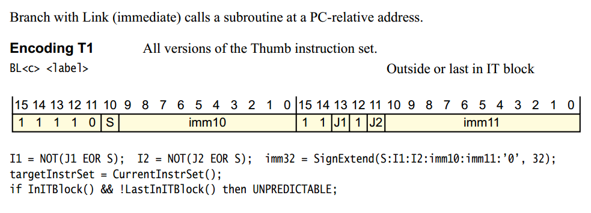

[toc]

# 1.实例解析
BL指令
```
.text:00008864 78 44                       ADD     R0, PC          ; "error"
.text:00008866 00 F0 81 FF                 BL      j_puts
.text:0000886A 01 21                       MOVS    R1, #1
```
j_puts地址
```
.text:0000976C             j_puts                                  ; CODE XREF: check_password(char *)+1AE↑p
.text:0000976C                                                     ; check_password(char *)+1C4↑p ...
.text:0000976C 78 47                       BX      PC
.text:0000976C             ; ---------------------------------------------------------------------------
.text:0000976E C0 46                       ALIGN 4
```
## 1. 首先来看一下手册上对BL指令的解释



根据指令格式可以知道thumb2指令为两个2字节的值构成(即每次只解析2字节)。
对应的固定格式为
```
1111 0Sxx xxxx xxxx 11M1 Nxxx xxxx xxxx
```
其中M代表J1，N代表J2, x代表立即数。

## 2. 将我们需要解析的指令转换为对应的进制
```
00 F0 
81 FF

1111 0000 0000 0000 1111 1111 1000 0001
1111 0Sxx xxxx xxxx 11M1 Nxxx xxxx xxxx
```
通过与上面的格式进行对比可以知道S=0, J1=1, J2=1。

然后再根据上面的公式可得到：
```
I1 = not(J1 xor S) = 0,  I2 = not(J1 xor S) = 0, 

imm32 = SignExtend(S:I1:I2:imm10:imm11:'0', 32) = 0000 0000 0000 0111 1000 0001 0 = 0xF02 。

offset = TargetAddr - CurAddr - 4 = 0x976C - 0x8866 -4 = 0xF02
```
以下是在网上找到的关于生成BL指令的方法。

**ARM**
```
UINT32 ARM_BL(UINT32 src_addr, UINT32 dst_addr)
{
        UINT32 offset = dst_addr-src_addr-8;
        offset &= 0x3FFFFFF; // 去掉最高6位
        offset >>= 2;
        return 0xEB000000+offset;
}
```
**Thumb**
```
UINT32 ExchangeHiLo(UINT32 v)
{
        UINT32 v1 = v >> 16;
        UINT32 v2 = (v & 0xFFFF) << 16;
        return v1 + v2;
}
UINT32 THUMB_BL(UINT32 src_addr, UINT32 dst_addr)
{
        UINT32 offset = dst_addr-(src_addr+4);
        offset &= 0x1FFFFFF; // 去掉最高7位

        UINT32 S_ = (offset & 0x1000000) >> 24;
        UINT32 I1 = (offset & 0x800000) >> 23;
        UINT32 I2 = (offset & 0x400000) >> 22;
        UINT32 imm10 = (offset & 0x3FF000) >> 12;
        UINT32 imm11 = (offset & 0xFFE) >> 1;
        UINT32 J1 = (!I1)^S_;
        UINT32 J2 = (!I2)^S_;

        S_ <<= 26;
        imm10 <<= 16;
        J1 <<= 13;
        J2 <<= 11;

        UINT32 code = 0xF000D000+S_+imm10+J1+J2+imm11;
        return ExchangeHiLo(code);
}
```

