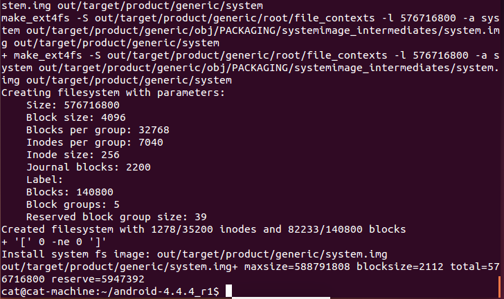
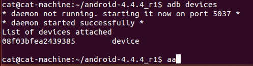

[toc]

本笔记记录了使用ubuntu18.04编译并刷机的整个过程。


# 1. 环境搭建
## 1. 安装ubuntu虚拟机
我使用的VMWare虚拟机，安装过程可以参考网上的一些教程，比较简单，就略过了。

## 2. 配置java环境
### 1. 下载`jdk-6u45-linux-x64.bin`
下载地址
```
http://bridsys.com/downloads/java/
https://gist.github.com/gsitgithub/c7010ea8945a7b1b9f754345f2dd5cd3
```

### 2. 安装`jdk-6u45-linux-x64.bin`
复制`jdk-6u45-linux-x64.bin`到安装目录

假设`jdk-6u45-linux-x64.bin`放在HMOE目录，我们要安装的目录为：/usr/local/Java。 
我们先在 /usr/local/目录下创建java文件夹：
```
ckcat@ubuntu-machine:~$ cd /usr/local
ckcat@ubuntu-machine:/usr/local$ ls
bin  etc  games  include  lib  man  sbin  share  src
ckcat@ubuntu-machine:/usr/local$ sudo mkdir java
ckcat@ubuntu-machine:/usr/local$ ls
bin  etc  games  include  java  lib  man  sbin  share  src
```
复制`jdk-6u45-linux-x64.bin`到安装目录
```
ckcat@ubuntu-machine:~$ sudo cp jdk-6u45-linux-x64.bin /usr/local/java
```

### 3. 安装`jdk-6u45-linux-x64.bin`
```
ckcat@ubuntu-machine:~$ cd /usr/local
ckcat@ubuntu-machine:/usr/local$ ls
bin  etc  games  include  java  lib  man  sbin  share  src
ckcat@ubuntu-machine:/usr/local$ cd java/
ckcat@ubuntu-machine:/usr/local/java$ sudo chmod 777 jdk-6u45-linux-x64.bin 
ckcat@ubuntu-machine:/usr/local/java$ sudo ./jdk-6u45-linux-x64.bin  
```

### 4. 配置java环境变量
1. 打开/ect/profile 文件
```
sudo gedit /etc/profile
```

2. 在`profile`文件中添加下面的环境变量，根据安装目录修改，并保存
```
# Java Environment
export JAVA_HOME=/usr/local/java/jdk1.6.0_45  
export JRE_HOME=/usr/local/java/jdk1.6.0_45/jre  
export CLASSPATH=.:$JAVA_HOME/lib:$JRE_HOME/lib:$CLASSPATH  
export PATH=$JAVA_HOME/bin:$JRE_HOME/bin:$JAVA_HOME:$PATH 
```

3. 重启后使其生效并进行验证，也可使用下面的命令不重启使其生效，不过只针对当前域有效。
```
ckcat@ubuntu-machine:/usr/local/java$ source /etc/profile
ckcat@ubuntu-machine:/usr/local/java$ 
```
输入java -version 进行验证，成功后如下：
```
ckcat@ubuntu-machine:~$ java -version
java version "1.6.0_45"
Java(TM) SE Runtime Environment (build 1.6.0_45-b06)
Java HotSpot(TM) 64-Bit Server VM (build 20.45-b01, mixed mode)
```

4. 如果安装多个版本的java,可以使用下列命令设置默认的java版本。
```
//查询当前jdk 配置
 sudo update-alternatives --display java
 //手动切换java javac版本
sudo update-alternatives --config java
sudo update-alternatives --config javac
```

## 3. 安装依赖库
使用下列命令安装依赖库（参考android官方源码编译）
```
sudo apt-get install -y git flex bison gperf build-essential libncurses5-dev:i386 
sudo apt-get install libx11-dev:i386 libreadline6-dev:i386 libgl1-mesa-dev g++-multilib 
sudo apt-get install tofrodos python-markdown libxml2-utils xsltproc zlib1g-dev:i386 
sudo apt-get install dpkg-dev libsdl1.2-dev libesd0-dev
sudo apt-get install git-core gnupg flex bison gperf build-essential  
sudo apt-get install zip curl zlib1g-dev gcc-multilib g++-multilib 
sudo apt-get install libc6-dev-i386 
sudo apt-get install lib32ncurses5-dev x11proto-core-dev libx11-dev 
sudo apt-get install lib32z-dev ccache
sudo apt-get install libgl1-mesa-dev libxml2-utils xsltproc unzip m4
```

## 4. 降级make版本
编译android4.4.4需要make 3.81或3.82 ，所以要降级make，可以使用`make -version`命令查看make的版本。
下载 make-3.82.tar.gz ：ftp://ftp.gnu.org/gnu/make/
```
tar -zxvf make-3.82.tar.gz
cd make-3.82
sudo ./configure
sudo make
sudo make install
```

至此，android的编译环境已经搭建好了。


# 2. 准备好源码以及驱动

## 1. 源码下载
### 1. 使用已经打包好的源码
下载地址：https://testerhome.com/topics/2229 。
使用这种方式下载的android源码没有.repo文件夹，如果需要可以使用下面的两个步骤初始化仓库。

### 2. 使用清华源下载(这种方式比较慢，不推荐)
1. 使用curl下载repo到指定的目录
```
mkdir ~/android-4.4.4_r1 
PATH=~/android-4.4.4_r1:$PATH
curl https://storage.googleapis.com/git-repo-downloads/repo > ~/android-4.4.4_r1/repo
chmod a+x ~/android-4.4.4_r1/repo
```

2. 初始化仓库
```
repo init -u https://aosp.tuna.tsinghua.edu.cn/platform/manifest  -b android-4.4.4_r1
```
`repo init` 后，会提示你输入名字和邮箱，可以直接使用默认设置的直接输入y然后回车，提示repo初始完。

3. 同步源码树
```
repo sync
```
接着就是漫长的等待，如果中间出现中断，只要重复该命令即可。 
同步完成以后，占用的空间比较大，主要是`.repo`目录中的`project-objects`文件占用空间比较大，可以直接删掉。
参考链接：https://mirrors.tuna.tsinghua.edu.cn/help/AOSP/

## 2. 下载驱动
由于我使用的是NEXUS 5 设备，并且打算编译Android 4.4.4_r1版本，所以去官方 Nexus 和 Pixel 设备的二进制驱动下载页面：https://developers.google.com/android/drivers 下载了相应的二进制驱动。
将三个压缩包解压出的自解压脚本放在源码树的根目录下并运行将会得到一个`Vendor`目录 。

# 3. 编译源码

## 1. 命令删除所有以前编译操作的已有输出：
`make clobber`

## 2. 使用` build`目录中的`envsetup.sh `脚本初始化环境
`source build/envsetup.sh`
   
## 3. 使用lunch选择要编译的目标
```
ckcat@ckcat-virtual-machine:~/android-4.4.4_r1$ lunch

You're building on Linux

Lunch menu... pick a combo:
     1. aosp_arm-eng
     2. aosp_x86-eng
     3. aosp_mips-eng
     4. vbox_x86-eng
     5. mini_mips-userdebug
     6. mini_x86-userdebug
     7. mini_armv7a_neon-userdebug
     8. aosp_deb-userdebug
     9. aosp_grouper-userdebug
     10. aosp_flo-userdebug
     11. aosp_tilapia-userdebug
     12. aosp_manta-userdebug
     13. aosp_hammerhead-userdebug
     14. aosp_mako-userdebug

Which would you like? [aosp_arm-eng] 13

```
选择你想编译的版本，这里我选的是 aosp_hammerhead-userdebug,所以输入13，

## 4. 编译代码
```
make -j8    #-j8的意思是8个线程同步编译。
```
关于cpu个数，可以用下面命令查看:
```
cat /proc/cpuinfo | grep processor
```
 经过漫长的等待后就编译完成界面，如果中途出错就根据错误信息谷歌一下或者重新编译。


# 4. 刷机
## 1. 手机开启调试模式，连上电脑，执行`adb devices`命令将会显示连接的机器。


## 2. 以fastboot模式启动手机，然后进行刷机
    `adb reboot bootloader`
    
## 3. 刷机
    `fastboot -w flashall`

至此整个编译源码并刷机的过成圆满结束了。


# 5、遇到的一些坑
## 1. 编译过程种突然中止，怎么都找不到原因
    * 可能是给的内存太小。
    * 重新编译几次就好了。

## 2. adb devices 出现了?????,nopermissions没有权限的问题
经过百度得，原因是ubuntu这样的系统都是默认以非root身份在运行的，要使用usb调试，需要sudo支持
解决方法:
1. 输入命令lsusb，查看usb的使用情况,记录下android设备的ID
2. 输入命令sudo vim /etc/udev/rules.d/70-android.rules，在里面输入以下内容并且保存，需要注意的是，下面内容中的ATTRS{}中的内容为ID的值。
`SUBSYSTEM=="usb",ATTRS{idVendor}=="18d1",ATTRS{idProduct}=="9025",MODE="0666"`
3. 保存之后就给该文件赋予相关权限sudo chmod a+rx /etc/udev/rules.d/70-android.rules
4. 输入命令sudo service udev restart重启udev
5. 不需要重启计算机，重新启动adb server，拔掉usb重新连上再执行adb devices即可。
参考：http://www.cnblogs.com/xiaoxuetu/p/3224386.html

## 3. adb以及fastboot运行后提示需要安装
此时可以到android源码目录运行` build`目录中的`envsetup.sh `脚本初始化环境
    `source build/envsetup.sh`

参考：

[xposed源码编译与集成](https://www.jianshu.com/p/6471bab49cb1)

[记一次安卓系统源码下载过程](https://bbs.pediy.com/thread-218366.htm)

[记一次安卓系统源码编译刷机过程](https://bbs.pediy.com/thread-218513.htm)

[记一次安卓内核源码编译刷机过程(修改反调试标志位)](https://bbs.pediy.com/thread-219233.htm)